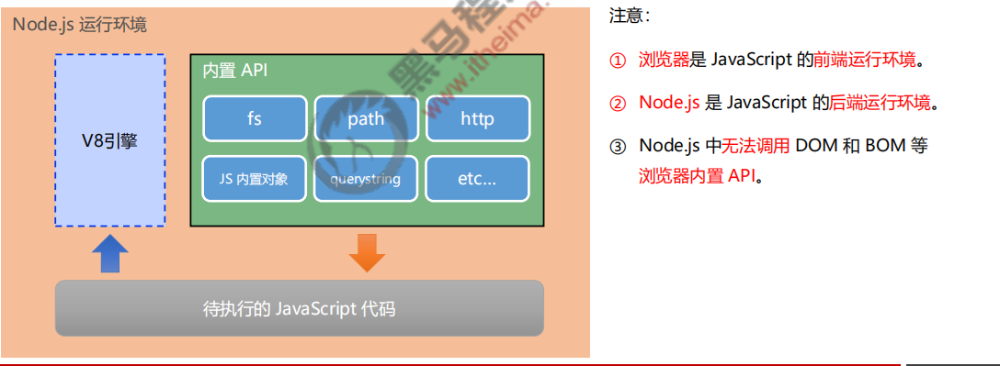
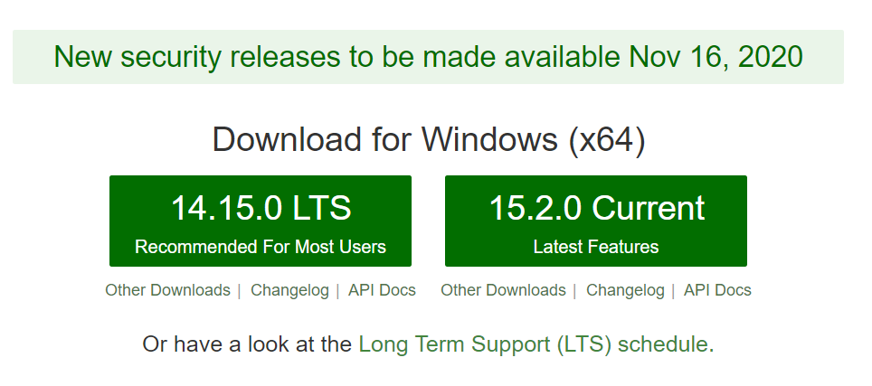
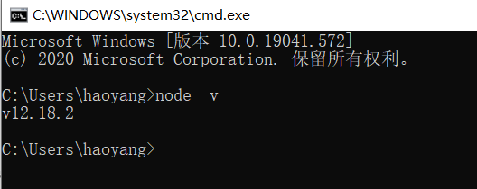
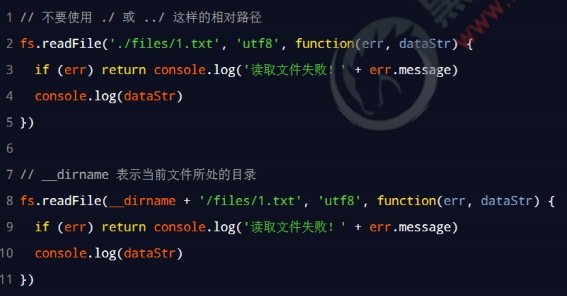
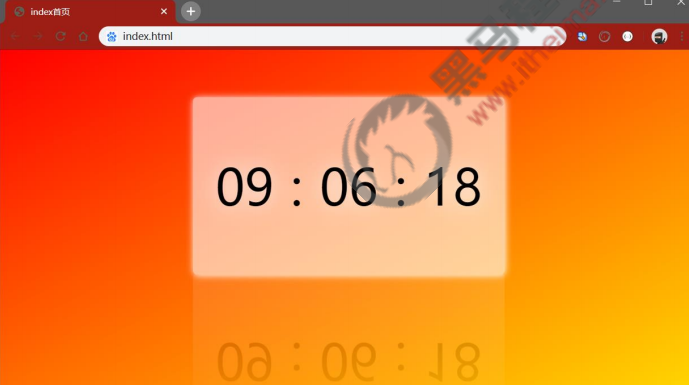

# 目标

◆ 能够知道什么是 Node.js

◆ 能够知道 Node.js 可以做什么

◆ 能够说出 Node.js 中的 JavaScript 的组成部分

◆ 能够使用 fs 模块读写操作文件

◆ 能够使用 path 模块处理路径

# **Node.js 简介**

##  1.**什么是 Node.js**

**Node.js®** is a JavaScript runtime built on Chrome's V8 JavaScript engine.

Node.js 是一个基于 **Chrome V8** 引擎的 JavaScript 运行环境。

**Node.js 的官网地址**： https://nodejs.org/zh-cn/

## **2. **Node.js 中的 JavaScript 运行环境



## **3. Node.js 可以做什么**

Node.js 作为一个 JavaScript 的运行环境，仅仅提供了基础的功能和 API。然而，基于 Node.js 提供的这些基础能，很多强大的工具和框架如雨后春笋，层出不穷，所以学会了 Node.js ，可以让前端程序员胜任更多的工作和岗位：

**①** 基于 Express 框架（http://www.expressjs.com.cn/），可以快速构建 Web 应用

**②** 基于 Electron 框架（https://electronjs.org/），可以构建跨平台的桌面应用

**③** 基于 restify 框架（http://restify.com/），可以快速构建 API 接口项目

**④** 读写和操作数据库、创建实用的命令行工具辅助前端开发、etc…

总之：**Node.js 是大前端时代的“大宝剑”，有了 Node.js 这个超级 buff 的加持，前端程序员的行业竞争力会越来越强！**

## **4.Node.js 怎么学**

浏览器中的 JavaScript 学习路径：

JavaScript 基础语法 + 浏览器内置 API（DOM + BOM） + 第三方库（jQuery、art-template 等）


Node.js 的学习路径：

JavaScript 基础语法 + **Node.js 内置 API 模块（fs、path、http等）**+ **第三方 API 模块（express、mysql 等）**

## 5. **Node.js 环境的安装**

如果希望通过 Node.js 来运行 Javascript 代码，则必须在计算机上安装 Node.js 环境才行。

安装包可以从 Node.js 的官网首页直接下载，进入到 Node.js 的官网首页（**https://nodejs.org/en/**），点击

绿色的按钮，下载所需的版本后，双击直接安装即可。



## 6. **Node.js 环境的安装**

**1 .区分** **LTS** **版本和** **Current** **版本的不同**

**① LTS 为长期稳定版，对于追求稳定性的企业级项目来说，推荐安装 LTS 版本的 Node.js。** 

**② Current 为新特性尝鲜版，对热衷于尝试新特性的用户来说，推荐安装 Current 版本的 Node.js。但是，Current 版本中可能存在隐藏的 Bug 或安全性漏洞，因此不推荐在企业级项目中使用 Current 版本的 Node.js。**

## 7. **查看已安装的 Node.js 的版本号**

打开终端，在终端输入命令 **node –v** 后，按下回车键，即可查看已安装的 Node.js 的版本号。


Windows 系统快速打开终端的方式：

使用快捷键（**Windows徽标键 + R**）打开运行面板，输入 cmd 后直接回车，即可打开终端。




## 8. **什么是终端**

终端（英文：Terminal）是专门为开发人员设计的，用于实现人机交互的一种方式。

作为一名合格的程序员，我们有必要识记一些**常用的终端命令**，来辅助我们更好的操作与使用计算机。

## 9. **在 Node.js 环境中执行 JavaScript 代码**

**1. 终端中的快捷键**

在 Windows 的 powershell 或 cmd 终端中，我们可以通过如下快捷键，来提高终端的操作效率：

① 使用 **↑** 键，可以快速定位到上一次执行的命令

② 使用 **tab** 键，能够快速补全路径

③ 使用 **esc** 键，能够快速清空当前已输入的命令

④ 输入 **cls** 命令，可以清空终端


#  **fs 文件系统模块**

## 1.**什么是 fs 文件系统模块**

fs 模块是 Node.js 官方提供的、用来操作文件的模块。它提供了一系列的方法和属性，用来满足用户对文件的操作需求。

例如：

⚫ **fs.readFile()** 方法，用来读取指定文件中的内容

⚫ **fs.writeFile()** 方法，用来向指定的文件中写入内容

如果要在 JavaScript 代码中，使用 fs 模块来操作文件，则需要使用如下的方式先导入它：

```js
const fs  = require('fs')
```


##  2.**读取指定文件中的内容**

**1. fs.readFile() 的语法格式**

使用 fs.readFile() 方法，可以读取指定文件中的内容，语法格式如下：


参数解读：

⚫ 参数1：**必选**参数，字符串，表示文件的路径。

⚫ 参数2：可选参数，表示以什么**编码格式**来读取文件。

⚫ 参数3：**必选**参数，文件读取完成后，通过回调函数拿到读取的结果。


**2. fs.readFile() 的示例代码**

以 utf8 的编码格式，读取指定文件的内容，并打印 err 和 dataStr 的值：

```js
const fs = require('fs')
fs.readFile('./files/11.txt',"utf8",function(err,dataStr){
     console.log(err)
     console.log('-----')
     console.log(dataStr)
})
```

**3. 判断文件是否读取成功**

可以判断 err 对象是否为 null，从而知晓文件读取的结果：

```js
const fs = require('fs')

fs.readFile('./files/11.txt', 'utf8', function(err, dataStr) {
  if (err) {
    return console.log('读取文件失败！' + err.message)
  }
  console.log('读取文件成功！' + dataStr)
})

```

## 3.向指定的文件中写入内容

**1. fs.writeFile() 的语法格式**

使用 fs.writeFile() 方法，可以向指定的文件中写入内容，语法格式如下：


参数解读：

⚫ 参数1：**必选**参数，需要指定一个文件路径的字符串，表示文件的存放路径。

⚫ 参数2：必选参数，表示要**写入的内容**。

⚫ 参数3：可选参数，表示以什么格式写入文件内容，**默认值是 utf8**。 

⚫ 参数4：**必选**参数，文件写入完成后的**回调函数**。


**2. fs.writeFile() 的示例代码**

向指定的文件路径中，写入文件内容：

```js
const fs = require('fs')

fs.writeFile('./files/2.txt', 'Hello Node.js', function(err) {
   console.log(err)
})
```


**3. 判断文件是否写入成功**

可以判断 err 对象是否为 null，从而知晓文件写入的结果：

```js
const fs = require('fs')

fs.writeFile('./files/2.txt', 'Hello Node.js', function(err) {
   if (err) {
    return console.log('文件写入失败！' + err.message)
  }
  console.log('文件写入成功！')
})
```

## 4.**练习 - 考试成绩整理**

使用 fs 文件系统模块，将素材目录下成绩.txt文件中的考试数据，整理到成绩-ok.txt文件中。

整理前，成绩.txt文件中的数据格式如下


整理完成之后，希望得到的成绩-ok.txt文件中的数据格式如下：


**核心实现步骤**

**① 导入需要的 fs 文件系统模块**

**② 使用 fs.readFile() 方法，读取素材目录下的 成绩.txt 文件**

**③ 判断文件是否读取失败**

**④ 文件读取成功后，处理成绩数据**

**⑤ 将处理完成的成绩数据，调用 fs.writeFile() 方法，写入到新文件 成绩-ok.txt 中**

代码如下:

```js
// 1. 导入 fs 模块
const fs = require('fs')

// 2. 调用 fs.readFile() 读取文件的内容
fs.readFile('../素材/成绩.txt', 'utf8', function(err, dataStr) {
  // 3. 判断是否读取成功
  if (err) {
    return console.log('读取文件失败！' + err.message)
  }
  // console.log('读取文件成功！' + dataStr)

  // 4.1 先把成绩的数据，按照空格进行分割
  const arrOld = dataStr.split(' ')
  // 4.2 循环分割后的数组，对每一项数据，进行字符串的替换操作
  const arrNew = []
  arrOld.forEach(item => {
    arrNew.push(item.replace('=', '：'))
  })
  // 4.3 把新数组中的每一项，进行合并，得到一个新的字符串
  const newStr = arrNew.join('\r\n')

  // 5. 调用 fs.writeFile() 方法，把处理完毕的成绩，写入到新文件中
  fs.writeFile('./files/成绩-ok.txt', newStr, function(err) {
    if (err) {
      return console.log('写入文件失败！' + err.message)
    }
    console.log('成绩写入成功！')
  })
})

```

## 5.**fs 模块 - 路径动态拼接的问题**

在使用 fs 模块操作文件时，如果提供的操作路径是以 ./ 或 ../ 开头的相对路径时，很容易出现路径动态拼接错误的问题。

**原因**：代码在运行的时候，会以执行 node 命令时所处的目录，动态拼接出被操作文件的完整路径。

**解决方案**：在使用 fs 模块操作文件时，直接提供完整的路径，不要提供 ./ 或 ../ 开头的相对路径，从而防止路径动态拼接的问题。




#  **path 路径模块**

## 1.  **什么是 path 路径模块**

path 模块是 Node.js 官方提供的、用来处理路径的模块。它提供了一系列的方法和属性，用来满足用户对路径的处理

需求。

例如：

⚫ path.join() 方法，用来将多个路径片段拼接成一个完整的路径字符串

⚫ path.basename() 方法，用来从路径字符串中，将文件名解析出来

如果要在 JavaScript 代码中，使用 path 模块来处理路径，则需要使用如下的方式先导入它：

```js
const path = require('path')
```

## 2.  **路径拼接**

**1.** **path.join()** **的语法格式**

使用 path.join() 


参数解读：

⚫ ...paths <string> 路径片段的序列

⚫ 返回值: <string>

**2.** **path.join()** **的代码示例**

使用 path.join() 方法，可以把多个路径片段拼接为完整的路径字符串：

```js
 const pathStr = path.join('/a', '/b/c', '../../', './d', 'e')
 console.log(pathStr)  // \a\b\d\e

const pathStr2= fs.readFile(__dirname + '/files/1.txt')
console.log(pathStr2)
```

注意：**今后凡是涉及到路径拼接的操作，都要使用 path.join() 方法进行处理**。不要直接使用 + 进行字符串的拼接。

## 3.**获取路径中的文件名**

**1. path.basename() 的语法格式**

使用 path.basename() 方法，可以获取路径中的最后一部分，经常通过这个方法获取路径中的文件名，语法格式如下：


参数解读：

⚫ path <string> 必选参数，表示一个路径的字符串

⚫ ext <string> 可选参数，表示文件扩展名

⚫ 返回: <string> 表示路径中的最后一部分

**2. path.basename() 的代码示例**

使用 path.basename() 方法，可以从一个文件路径中，获取到文件的名称部分：

```js
const path = require('path')

// 定义文件的存放路径
const fpath = '/a/b/c/index.html'

 const fullName = path.basename(fpath)
 console.log(fullName)

const nameWithoutExt = path.basename(fpath, '.html')
console.log(nameWithoutExt)
```

## 4. **获取路径中的文件扩展名**

**1. path.extname() 的语法格式**

使用 path.extname() 方法，可以获取路径中的扩展名部分，语法格式如下:


参数解读：

⚫ path <string>必选参数，表示一个路径的字符串

⚫ 返回: <string> 返回得到的扩展名字符串


**2. path.extname() 的代码示例**

使用 path.extname() 方法，可以获取路径中的扩展名部分：

```js
const path = require('path')

// 这是文件的存放路径
const fpath = '/a/b/c/index.html'

const fext = path.extname(fpath)
console.log(fext)
```

# **综合案例 - 时钟案例**

## **1. 案例要实现的功能**

将素材目录下的 index.html 页面，

拆分成三个文件，分别是：

⚫ index.css

⚫ index.js

⚫ index.html

并且将拆分出来的 3 个文件，存放到 clock 目录中



## 2.**案例的实现步骤**

**① 创建两个正则表达式，分别用来匹配 <style> 和 <script> 标签**

**② 使用 fs 模块，读取需要被处理的 HTML 文件**

**③ 自定义 resolveCSS 方法，来写入 index.css 样式文件**

**④ 自定义 resolveJS 方法，来写入 index.js 脚本文件**

**⑤ 自定义 resolveHTML 方法，来写入 index.html 文件**


##  3. 步骤1 - 导入需要的模块并创建正则表达式

````js
// 1.1 导入 fs 模块
const fs = require('fs')
// 1.2 导入 path 模块
const path = require('path')

// 1.3 定义正则表达式，分别匹配 <style></style> 和 <script></script> 标签
const regStyle = /<style>[\s\S]*<\/style>/
const regScript = /<script>[\s\S]*<\/script>/
````


## **4. 步骤2 - 使用 fs 模块读取需要被处理的 html 文件**

````js
// 2.1 调用 fs.readFile() 方法读取文件
fs.readFile(path.join(__dirname, '../素材/index.html'), 'utf8', function(err, dataStr) {
  // 2.2 读取 HTML 文件失败
  if (err) return console.log('读取HTML文件失败！' + err.message)
  // 2.3 读取文件成功后，调用对应的三个方法，分别拆解出 css, js, html 文件
  resolveCSS(dataStr)
  resolveJS(dataStr)
  resolveHTML(dataStr)
})
````

##  5.**步骤3 – 自定义 resolveCSS 方法**

````js
// 3.1 定义处理 css 样式的方法
function resolveCSS(htmlStr) {
  // 3.2 使用正则提取需要的内容
  const r1 = regStyle.exec(htmlStr)
  // 3.3 将提取出来的样式字符串，进行字符串的 replace 替换操作
  const newCSS = r1[0].replace('<style>', '').replace('</style>', '')
  // 3.4 调用 fs.writeFile() 方法，将提取的样式，写入到 clock 目录中 index.css 的文件里面
  fs.writeFile(path.join(__dirname, './clock/index.css'), newCSS, function(err) {
    if (err) return console.log('写入 CSS 样式失败！' + err.message)
    console.log('写入样式文件成功！')
  })
}
````

## 6. **步骤4 – 自定义 resolveJS 方法**

```js
// 4.1 定义处理 js 脚本的方法
function resolveJS(htmlStr) {
  // 4.2 通过正则，提取对应的 <script></script> 标签内容
  const r2 = regScript.exec(htmlStr)
  // 4.3 将提取出来的内容，做进一步的处理
  const newJS = r2[0].replace('<script>', '').replace('</script>', '')
  // 4.4 将处理的结果，写入到 clock 目录中的 index.js 文件里面
  fs.writeFile(path.join(__dirname, './clock/index.js'), newJS, function(err) {
    if (err) return console.log('写入 JavaScript 脚本失败！' + err.message)
    console.log('写入 JS 脚本成功！')
  })
}
```

## 7. **步骤5 – 自定义 resolveHTML 方法**

```js
// 5.1 定义处理 HTML 结构的方法
function resolveHTML(htmlStr) {
  // 5.2 将字符串调用 replace 方法，把内嵌的 style 和 script 标签，替换为外联的 link 和 script 标签
  const newHTML = htmlStr.replace(regStyle, '<link rel="stylesheet" href="./index.css" />').replace(regScript, '<script src="./index.js"></script>')
  // 5.3 写入 index.html 这个文件
  fs.writeFile(path.join(__dirname, './clock/index.html'), newHTML, function(err) {
    if (err) return console.log('写入 HTML 文件失败！' + err.message)
    console.log('写入 HTML 页面成功！')
  })
}
```

## 8.**案例的两个注意点**

**① fs.writeFile() 方法只能用来创建文件，不能用来创建路径**

**② 重复调用 fs.writeFile() 写入同一个文件，新写入的内容会覆盖之前的旧内容**

## 9.完整实例代码

```js
// 1.1 导入 fs 模块
const fs = require('fs')
// 1.2 导入 path 模块
const path = require('path')

// 1.3 定义正则表达式，分别匹配 <style></style> 和 <script></script> 标签
const regStyle = /<style>[\s\S]*<\/style>/
const regScript = /<script>[\s\S]*<\/script>/

// 2.1 调用 fs.readFile() 方法读取文件
fs.readFile(path.join(__dirname, '../素材/index.html'), 'utf8', function(err, dataStr) {
  // 2.2 读取 HTML 文件失败
  if (err) return console.log('读取HTML文件失败！' + err.message)
  // 2.3 读取文件成功后，调用对应的三个方法，分别拆解出 css, js, html 文件
  resolveCSS(dataStr)
  resolveJS(dataStr)
  resolveHTML(dataStr)
})

// 3.1 定义处理 css 样式的方法
function resolveCSS(htmlStr) {
  // 3.2 使用正则提取需要的内容
  const r1 = regStyle.exec(htmlStr)
  // 3.3 将提取出来的样式字符串，进行字符串的 replace 替换操作
  const newCSS = r1[0].replace('<style>', '').replace('</style>', '')
  // 3.4 调用 fs.writeFile() 方法，将提取的样式，写入到 clock 目录中 index.css 的文件里面
  fs.writeFile(path.join(__dirname, './clock/index.css'), newCSS, function(err) {
    if (err) return console.log('写入 CSS 样式失败！' + err.message)
    console.log('写入样式文件成功！')
  })
}

// 4.1 定义处理 js 脚本的方法
function resolveJS(htmlStr) {
  // 4.2 通过正则，提取对应的 <script></script> 标签内容
  const r2 = regScript.exec(htmlStr)
  // 4.3 将提取出来的内容，做进一步的处理
  const newJS = r2[0].replace('<script>', '').replace('</script>', '')
  // 4.4 将处理的结果，写入到 clock 目录中的 index.js 文件里面
  fs.writeFile(path.join(__dirname, './clock/index.js'), newJS, function(err) {
    if (err) return console.log('写入 JavaScript 脚本失败！' + err.message)
    console.log('写入 JS 脚本成功！')
  })
}

// 5.1 定义处理 HTML 结构的方法
function resolveHTML(htmlStr) {
  // 5.2 将字符串调用 replace 方法，把内嵌的 style 和 script 标签，替换为外联的 link 和 script 标签
  const newHTML = htmlStr.replace(regStyle, '<link rel="stylesheet" href="./index.css" />').replace(regScript, '<script src="./index.js"></script>')
  // 5.3 写入 index.html 这个文件
  fs.writeFile(path.join(__dirname, './clock/index.html'), newHTML, function(err) {
    if (err) return console.log('写入 HTML 文件失败！' + err.message)
    console.log('写入 HTML 页面成功！')
  })
}

```

