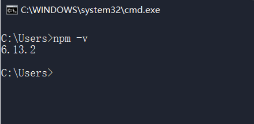
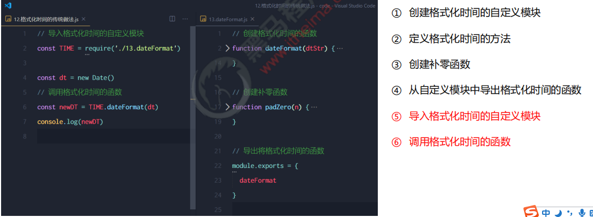

# 目标

- 能够理解IP、域名、域名服务器、端口号相关的概念

- 能够知道如何创建基本的Web服务器
- 能够说出什么是模块化以及模块化的好处
- 能够知道如何向外共享模块作用域中的成员
- 能够知道Node.js中模块分成了哪三大类
- 能够知道如何使用 npm install 命令安装需要的包

# **http 模块**

## 1.什么是http模块

回顾：什么是客户端、什么是服务器？

在网络节点中，负责消费资源的电脑，叫做**客户端**；负责对外提供网络资源的电脑，叫做**服务器。**

http 模块是 Node.js 官方提供的、用来创建 web 服务器的模块。通过 http 模块提供的 http.createServer() 方法，就能方便的把一台普通的电脑，变成一台 Web 服务器，从而对外提供 Web 资源服务。

如果要希望使用 http 模块创建 Web 服务器，则需要先导入它：


## 2.**进一步理解 http 模块的作用**

服务器和普通电脑的**区别**在于，服务器上安装了 web 服务器软件，例如：IIS、Apache 等。通过安装这些服务器软件，

就能把一台普通的电脑变成一台 web 服务器。

在 Node.js 中，我们不需要使用 IIS、Apache 等这些第三方 web 服务器软件。因为我们可以基于 Node.js 提供的

http 模块，**通过几行简单的代码，就能轻松的手写一个服务器软件**，从而对外提供 web 服务。

# **服务器相关的概念**

## **1. IP 地址**

**IP 地址**就是互联网上每台计算机的唯一地址，因此 IP 地址具有唯一性。如果把“个人电脑”比作“一台电话”，那么“IP地

址”就相当于“电话号码”，只有在知道对方 IP 地址的前提下，才能与对应的电脑之间进行数据通信。

IP 地址的格式：通常用“点分十进制”表示成（a.b.c.d）的形式，其中，a,b,c,d 都是 0~255 之间的十进制整数。例如：用

点分十进表示的 IP地址（192.168.1.1）

注意：

**① 互联网中每台 Web 服务器，都有自己的 IP 地址**，例如：大家可以在 Windows 的终端中运行 ping www.baidu.com 命令，即可查看到百度服务器的 IP 地址。

② 在开发期间，自己的电脑既是一台服务器，也是一个客户端，为了方便测试，可以在自己的浏览器中输入 127.0.0.1 这个IP 地址，就能把自己的电脑当做一台服务器进行访问了

## **2.** **域名和域名服务器**

尽管 IP 地址能够唯一地标记网络上的计算机，但IP地址是一长串数字，不直观，而且不便于记忆，于是人们又发明了另一套字符型的地址方案，即所谓的**域名（Domain Name）地址**。

IP地址和域名是一一对应的关系，这份对应关系存放在一种叫做**域名服务器**(DNS，Domain name server)的电脑中。使用者只需通过好记的域名访问对应的服务器即可，对应的转换工作由域名服务器实现。因此，**域名服务器就是提供 IP 地址和域名之间的转换服务的服务器**。

注意：

① 单纯使用 IP 地址，互联网中的电脑也能够正常工作。但是有了域名的加持，能让互联网的世界变得更加方便。

② 在开发测试期间， 127.0.0.1 对应的域名是 localhost，它们都代表我们自己的这台电脑，在使用效果上没有任何区别。

## **3. 端口号**

计算机中的端口号，就好像是现实生活中的门牌号一样。通过门牌号，外卖小哥可以在整栋大楼众多的房间中，准确把外卖

送到你的手中。

同样的道理，在一台电脑中，可以运行成百上千个 web 服务。每个 web 服务都对应一个唯一的端口号。客户端发送过来的

网络请求，通过端口号，可以被准确地交给对应的 web 服务进行处理。


# **创建最基本的 web 服务器**

## **1. 创建 web 服务器的基本步骤**

**① 导入 http 模块**

**② 创建 web 服务器实例**

**③ 为服务器实例绑定 request 事件，监听客户端的请求**

**④ 启动服务器**

## **2. 步骤1 - 导入 http 模块**

如果希望在自己的电脑上创建一个 web 服务器，从而对外提供 web 服务，则需要导入 http 模块：

```JS
const http = require('http')
```

## 3. 步骤2 - 创建 web 服务器实例

调用 http.createServer() 方法，即可快速创建一个 web 服务器实例：

```js
const server = http.createServer()
```

## 4.**步骤3 - 为服务器实例绑定 request 事件**

为服务器实例绑定 request 事件，即可监听客户端发送过来的网络请求：

```js
server.on('request', function (req, res) {
  console.log('Someone visit our web server.')
})
```

## 5. **启动服务器**

调用服务器实例的 .listen() 方法，即可启动当前的 web 服务器实例：

```js
// 4. 启动服务器
server.listen(80, function () {  
  console.log('server running at http://127.0.0.1')
})

```

## 6.  **req** **请求对象**

只要服务器接收到了客户端的请求，就会调用通过 server.on() 为服务器绑定的 request 事件处理函数。

如果想在事件处理函数中，访问与客户端相关的**数据**或**属性**，可以使用如下的方式：

```js
server.on('request', (req) => {
  // req.url 是客户端请求的 URL 地址
  const url = req.url
  // req.method 是客户端请求的 method 类型
  const method = req.method
  const str = `Your request url is ${url}, and request method is ${method}`
  console.log(str)
})
```

## 7. **res** **响应对象**

在服务器的 request 事件处理函数中，如果想访问与服务器相关的**数据**或**属性**，可以使用如下的方式：

```js
server.on('request', (req, res) => {
  // req.url 是客户端请求的 URL 地址
  const url = req.url
  // req.method 是客户端请求的 method 类型
  const method = req.method
  const str = `Your request url is ${url}, and request method is ${method}`
  console.log(str)
  res.end(str)
})
```

## 8. **解决中文乱码问题**

当调用 **res.end()** 方法，向客户端发送中文内容的时候，会出现乱码问题，此时，需要手动设置内容的编码格式：

```js
server.on('request', (req, res) => {
  // 定义一个字符串，包含中文的内容
  const str = `您请求的 URL 地址是 ${req.url}，请求的 method 类型为 ${req.method}`
  // 调用 res.setHeader() 方法，设置 Content-Type 响应头，解决中文乱码的问题
  res.setHeader('Content-Type', 'text/html; charset=utf-8')
  // res.end() 将内容响应给客户端
  res.end(str)
})
```

# **根据不同的 url 响应不同的 html 内容**

##  **1. 核心实现步骤**

**① 获取请求的 url 地址**

**② 设置默认的响应内容为 404 Not found**

**③ 判断用户请求的是否为 / 或 /index.html 首页**

**④ 判断用户请求的是否为 /about.html 关于页面**

**⑤ 设置 Content-Type 响应头，防止中文乱码**

**⑥ 使用 res.end() 把内容响应给客户端**

## **2. 动态响应内容**

```js
const http = require('http')
const server = http.createServer()

server.on('request', (req, res) => {
  // 1. 获取请求的 url 地址
  const url = req.url
  // 2. 设置默认的响应内容为 404 Not found
  let content = '<h1>404 Not found!</h1>'
  // 3. 判断用户请求的是否为 / 或 /index.html 首页
  // 4. 判断用户请求的是否为 /about.html 关于页面
  if (url === '/' || url === '/index.html') {
    content = '<h1>首页</h1>'
  } else if (url === '/about.html') {
    content = '<h1>关于页面</h1>'
  }
  // 5. 设置 Content-Type 响应头，防止中文乱码
  res.setHeader('Content-Type', 'text/html; charset=utf-8')
  // 6. 使用 res.end() 把内容响应给客户端
  res.end(content)
})

server.listen(80, () => {
  console.log('server running at http://127.0.0.1')
})

```

#  **案例 - 实现 clock 时钟的 web 服务器**

**1. 核心思路**

把文件的实际存放路径，**作为**每个资源的请求 url 地址。


## **2. 实现步骤**

**① 导入需要的模块**

**② 创建基本的 web 服务器**

**③ 将资源的请求 url 地址映射为文件的存放路径**

**④ 读取文件内容并响应给客户端**

**⑤ 优化资源的请求路径**

## **3. 步骤1 - 导入需要的模块**

```js
// 1.1 导入 http 模块
const http = require('http')
// 1.2 导入 fs 模块
const fs = require('fs')
// 1.3 导入 path 模块
const path = require('path')
```

## **3. 步骤2 - 创建基本的 web 服务器**

```js

// 2. 创建 web 服务器实例
const server = http.createServer()
// 3. 为服务器实例绑定 request 事件，监听客户端的请求
server.on('request', function (req, res) {
 
})
// 4. 启动服务器
server.listen(80, function () {  
  console.log('server running at http://127.0.0.1')
})
```

## **3. 步骤3 - 将资源的请求 url 地址映射为文件的存放路径**

```js
//3.1 获取到客户端请求的url地址
const url = req.url
//3.2把 请求的url地址,映射为本地文件的存放地址
const fpath = path.join(__dirname,url)
```

## **3. 步骤4 - 读取文件的内容并响应给客户端**

```js
  // 4.1 根据“映射”过来的文件路径读取文件的内容
  fs.readFile(fpath, 'utf8', (err, dataStr) => {
    // 4.2 读取失败，向客户端响应固定的“错误消息”
    if (err) return res.end('404 Not found.')
    // 4.3 读取成功，将读取成功的内容，响应给客户端
    res.end(dataStr)
  })
```

## **3. 步骤5 – 优化资源的请求路径**

```js
  let fpath = ''
  if (url === '/') {
    fpath = path.join(__dirname, './clock/index.html')
  } else {
    fpath = path.join(__dirname, '/clock', url)
  }
```

## 4. 完整实例

```js
// 1.1 导入 http 模块
const http = require('http')
// 1.2 导入 fs 模块
const fs = require('fs')
// 1.3 导入 path 模块
const path = require('path')

// 2.1 创建 web 服务器
const server = http.createServer()
// 2.2 监听 web 服务器的 request 事件
server.on('request', (req, res) => {
  // 3.1 获取到客户端请求的 URL 地址
  //     /clock/index.html
  //     /clock/index.css
  //     /clock/index.js
  const url = req.url
  // 3.2 把请求的 URL 地址映射为具体文件的存放路径
  // const fpath = path.join(__dirname, url)
  // 5.1 预定义一个空白的文件存放路径
  let fpath = ''
  if (url === '/') {
    fpath = path.join(__dirname, './clock/index.html')
  } else {
    //     /index.html
    //     /index.css
    //     /index.js
    fpath = path.join(__dirname, '/clock', url)
  }

  // 4.1 根据“映射”过来的文件路径读取文件的内容
  fs.readFile(fpath, 'utf8', (err, dataStr) => {
    // 4.2 读取失败，向客户端响应固定的“错误消息”
    if (err) return res.end('404 Not found.')
    // 4.3 读取成功，将读取成功的内容，响应给客户端
    res.end(dataStr)
  })
})
// 2.3 启动服务器
server.listen(80, () => {
  console.log('server running at http://127.0.0.1')
})

```

# **模块化的基本概念**

## 1.**什么是模块化**

**模块化**是指解决一个复杂问题时，自顶向下逐层把系统划分成若干模块的过程。对于整个系统来说，模块是可组

合、分解和更换的单元。

## **2. 编程领域中的模块化**

编程领域中的模块化，就是**遵守固定的规则**，把一个大文件拆成独立并互相依赖的多个小模块。

把代码进行模块化拆分的好处：

**① 提高了代码的复用性**

**② 提高了代码的可维护性**

**③ 可以实现按需加载**

## 3. **模块化规范**

**模块化规范**就是对代码进行模块化的拆分与组合时，需要遵守的那些规则。

例如：

- 使用什么样的语法格式来引用模块

- 在模块中使用什么样的语法格式向外暴露成员

**模块化规范的好处**：大家都遵守同样的模块化规范写代码，降低了沟通的成本，极大方便了各个模块之间的相互调用，利人利己。

# **Node.js 中的模块化**

## 1.**Node.js 中模块的分类**

Node.js 中根据模块来源的不同，将模块分为了 3 大类，分别是：

- 内置模块（内置模块是由 Node.js 官方提供的，例如 fs、path、http 等）

- 自定义模块（用户创建的每个 .js 文件，都是自定义模块）

- 第三方模块（由第三方开发出来的模块，并非官方提供的内置模块，也不是用户创建的自定义模块，使用前需要先下载）

## 2. **加载模块**

使用强大的 require() 方法，可以加载需要的内置模块、用户自定义模块、第三方模块进行使用。例如：


**注意：使用 require() 方法加载其它模块时，会执行被加载模块中的代码**

# **Node.js 中的模块作用域**

## **1. 什么是 模块作用域**

和函数作用域类似，在自定义模块中定义的变量、方法等成员，只能在当前模块内被访问，这种模块级别的访问限制，叫做**模块作用域**


## 2.**模块作用域的好处**

防止了全局变量污染的问题


## 3. **向外共享模块作用域中的成员**

### **1.** **module** **对象**

在每个 .js 自定义模块中都有一个 module 对象，它里面存储了和当前模块有关的信息，打印如下：


### **2.** **module.exports** **对象**

在自定义模块中，可以使用 module.exports 对象，将模块内的成员共享出去，供外界使用。

外界用 require() 方法导入自定义模块时，得到的就是 module.exports 所指向的对象。

### **3. 共享成员时的注意点**

使用 require() 方法导入模块时，导入的结果，**永远以 module.exports 指向的对象为准**。


### **4.** **exports 对象**

由于 module.exports 单词写起来比较复杂，为了简化向外共享成员的代码，Node 提供了 exports 对象。默认情况下，exports 和 module.exports 指向同一个对象。**最终共享的结果，还是以 module.exports 指向的对象为准**


### 5.exports 和 module.exports 的使用误区

**时刻谨记，require() 模块时，得到的永远是 module.exports 指向的对象**


## 4.**Node.js 中的模块化规范**

Node.js 遵循了 CommonJS 模块化规范，CommonJS 规定了模块的特性和各模块之间如何相互依赖。

CommonJS 规定：

**① 每个模块内部，module 变量代表当前模块。**

**② module 变量是一个对象，它的 exports 属性（即 module.exports）是对外的接口。** 

**③ 加载某个模块，其实是加载该模块的 module.exports 属性。require() 方法用于加载模块。**

# **npm与包**

## 1. 什么是包

**Node.js 中的第三方模块又叫做包。**

就像电脑和计算机指的是相同的东西，第三方模块和包指的是同一个概念，只不过叫法不同。

## **2. 包的来源**

不同于 Node.js 中的内置模块与自定义模块，**包是由第三方个人或团队开发出来的，免费供所有人使用。**

**注意**：Node.js 中的包都是免费且开源的，不需要付费即可免费下载使用

## **3. 为什么需要包**

由于 Node.js 的内置模块仅提供了一些底层的 API，导致在基于内置模块进行项目开发的时，效率很低。

包是基于内置模块封装出来的，**提供了更高级、更方便的 API，极大的提高了开发效率。** 

包和内置模块之间的关系，类似于 jQuery 和 浏览器内置 API 之间的关系。

## **4. 从哪里下载包**

国外有一家 IT 公司，叫做 **npm, Inc.** 这家公司旗下有一个非常著名的网站： https://www.npmjs.com/ ，它是**全球最大的包共享平台**，你可以从这个网站上搜索到任何你需要的包，只要你有足够的耐心！

到目前位置，全球约 1100 多万的开发人员，通过这个包共享平台，开发并共享了超过 120 多万个包 供我们使用。

**npm, Inc. 公司**提供了一个地址为 https://registry.npmjs.org/ 的服务器，来对外共享所有的包，我们可以从这个服务器上下载自己所需要的包。

## **5. 如何下载包**

**npm, Inc. 公司**提供了一个包管理工具，我们可以使用这个包管理工具，从 https://registry.npmjs.org/ 服务器把需要的包下载到本地使用。

这个包管理工具的名字叫做 Node Package Manager（简称 npm 包管理工具），这个包管理工具随着 Node.js 的安装包一起被安装到了用户的电脑上。

大家可以在终端中执行 **npm -v** 命令，来查看自己电脑上所安装的 npm 包管理工具的版本号：



# **npm 初体验**

## **1. 格式化时间的传统做法**



## **2. 格式化时间的高级做法**

**① 使用 npm 包管理工具，在项目中安装格式化时间的包 moment**

**② 使用 require() 导入格式化时间的包**

**③ 参考 moment 的官方 API 文档对时间进行格式化**

```js
// 1. 导入需要的包
// 注意：导入的名称，就是装包时候的名称
const moment = require('moment')

const dt = moment().format('YYYY-MM-DD HH:mm:ss')
console.log(dt)
```

## **3. 在项目中安装包的命令**

如果想在项目中安装指定名称的包，需要运行如下的命令：


上述的装包命令，可以简写成如下格式：


## **4. 初次装包后****多了哪些文件**

初次装包完成后，在项目文件夹下多一个叫做 node_modules 的文件夹和 package-lock.json 的配置文件。

其中：

**node_modules 文件夹用来存放所有已安装到项目中的包。require() 导入第三方包时，就是从这个目录中查找并加载包。**

**package-lock.json 配置文件用来记录 node_modules 目录下的每一个包的下载信息，例如包的名字、版本号、下载地址等**。

注意：程序员不要手动修改 node_modules 或 package-lock.json 文件中的任何代码，npm 包管理工具会自动维护它们。

## **5. 安装指定版本的包**

默认情况下，使用 npm install 命令安装包的时候，会自动安装最新版本的包。如果需要安装指定版本的包，可以在包名之后，通过 @ 符号指定具体的版本，例如：

```shell
npm i moment@2.22.2
```

## **6. 包的语义化版本规范**

包的版本号是以“点分十进制”形式进行定义的，总共有三位数字，例如 **2.24.0**

其中每一位数字所代表的的含义如下：

第1位数字：**大版本**

第2位数字：**功能版本**

第3位数字：**Bug修复版本**

版本号提升的规则：只要前面的版本号增长了，则后面的版本号归零