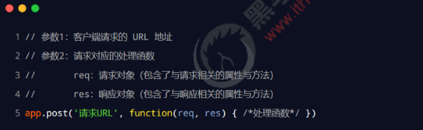

# 目标

- 能够说出package.json文件的作用
- 能够知道如何使用npm管理项目中的包
- 能够了解模块的加载机制
- 能够知道如何使用Express创建基本的Web服务器
- 能够知道如何使用express托管静态资源

# **包管理配置文件**

## 概念

npm 规定，在项目根目录中，**必须**提供一个叫做 package.json 的包管理配置文件。用来记录与项目有关的一些配置

信息。例如：

- 项目的名称、版本号、描述等

- 项目中都用到了哪些包

- 哪些包只在开发期间会用到
- 那些包在开发和部署时都需要用到

## **1. 多人协作的问题**


## **2. 如何记录项目中安装了哪些包**

在**项目根目录**中，创建一个叫做 package.json 的配置文件，即可用来记录项目中安装了哪些包。从而方便剔除

node_modules 目录之后，在团队成员之间共享项目的源代码。

**注意**：今后在项目开发中，一定要把 node_modules 文件夹，添加到 .gitignore 忽略文件中。

## **3. 快速创建 package.json**

npm 包管理工具提供了一个快捷命令，可以在执行命令时所处的目录中，快速创建 package.json 这个包管理配置文件：

```shell
npm init -y
```

注意：

① 上述命令**只能在英文的目录**下成功运行！所以，项目文件夹的名称一定要**使用英文命名**，不要使用中文，不能出现空格。 

② 运行 npm install 命令安装包的时候，npm 包管理工具会自动把包的名称和版本号，记录到 package.json 中。

## **4.** **dependencies** **节点**


## **5.** **一次性安装所有的包**

当我们拿到一个剔除了 node_modules 的项目之后，需要先把所有的包下载到项目中，才能将项目运行起来。

否则会报类似于下面的错误


可以运行 npm install 命令（或 npm i）一次性安装所有的依赖包：

```shell
npm install 
```

## **6. 卸载包**

可以运行 npm uninstall 命令，来卸载指定的包：

```shell
npm uninstall 包名
```

注意：npm uninstall 命令执行成功后，会把卸载的包，自动从 package.json 的 dependencies 中移除掉。

## **7.** **devDependencies** **节点**

如果某些包**只在项目开发阶段**会用到，在**项目上线之后不会用到**，则建议把这些包记录到 devDependencies 节点中。

与之对应的，如果某些包在开发和项目上线之后都需要用到，则建议把这些包记录到 dependencies 节点中。

您可以使用如下的命令，将包记录到 devDependencies 节点中：

```shell
npm i 包名 -D  //简写方式

npm install 包名 --save-dev
```

# **解决下包速度慢的问题**

## **1. 为什么下包速度慢**

在使用 npm 下包的时候，默认从国外的 https://registry.npmjs.org/ 服务器进行下载，此时，网络数据的传输需要经

过漫长的海底光缆，因此下包速度会很慢。

扩展阅读 - 海底光缆： 

- https://baike.baidu.com/item/%E6%B5%B7%E5%BA%95%E5%85%89%E7%BC%86/4107830

- https://baike.baidu.com/item/%E4%B8%AD%E7%BE%8E%E6%B5%B7%E5%BA%95%E5%85%89%E7%BC%86/10520363

- https://baike.baidu.com/item/APG/23647721?fr=aladdin

## **2. 淘宝 NPM 镜像服务器**

```shell
# 查看当前的下包镜像源
npm config get registry
#设置为淘宝镜像
npm config set registry https://registry.npm.taobao.org
#检查是否设置成功
npm config get registry
```


## **3.** **切换** **npm 的下包镜像源**

下包的镜像源，指的就是下包的服务器地址。


## **4. nrm**

为了更方便的切换下包的镜像源，我们可以安装 **nrm** 这个小工具，利用 nrm 提供的终端命令，可以快速查看和切换下包的镜像源

```shell
#安装nrm
npm i nrm -g
#查看可用镜像列表
nrm ls
#设置你需要的镜像
nrm use taobao
```

# **包的分类**

使用 npm 包管理工具下载的包，共分为两大类，分别是：

- 项目包

- 全局包

## **1. 项目包**

那些被安装到项目的 node_modules 目录中的包，都是项目包。

项目包又分为两类，分别是：

- 开发依赖包（被记录到 devDependencies 节点中的包，只在开发期间会用到）

- 核心依赖包（被记录到 dependencies 节点中的包，在开发期间和项目上线之后都会用到）

```shell
npm i 包名 -D #开发依赖包
npm i 包名    #核心依赖包
```

## **2. 全局包**

在执行 npm install 命令时，如果提供了 -g 参数，则会把包安装为全局包。

全局包会被安装到 C:\Users\用户目录\AppData\Roaming\npm\node_modules 目录下

```shell
npm i 包名 -g #全局安装
npm uninstall 包名 -g # 卸载全局包
```

注意：

① 只有工具性质的包，才有全局安装的必要性。因为它们提供了好用的终端命令。

② 判断某个包是否需要全局安装后才能使用，可以参考官方提供的使用说明即可

## **3. i5ting_toc**

i5ting_toc 是一个可以把 md 文档转为 html 页面的小工具，使用步骤如下：


# **规范的包结构**

在清楚了包的概念、以及如何下载和使用包之后，接下来，我们深入了解一下包的内部结构。

一个规范的包，它的组成结构，必须符合以下 3 点要求：

**① 包必须以单独的目录而存在**

**② 包的顶级目录下要必须包含 package.json 这个包管理配置文件**

**③ package.json 中必须包含 name，version，main 这三个属性，分别代表包的名字、版本号、包的入口。**

注意：以上 3 点要求是一个规范的包结构必须遵守的格式，关于更多的约束，可以参考如下网址：

https://yarnpkg.com/zh-Hans/docs/package-json

# **开发属于自己的包**

## **1. 需要实现的功能**

**① 格式化日期**

**② 转义 HTML 中的特殊字符**

**③ 还原 HTML 中的特殊字符**

### 1.1.**需要实现的功能**


### **1.2. 需要实现的功能**


### 1.3. 需要实现的功能


## **2. 初始化包的基本结构**

① 新建 itheima-tools 文件夹，作为包的根目录

② 在 itheima-tools 文件夹中，新建如下三个文件：

- package.json （包管理配置文件）

- index.js （包的入口文件）

- README.md （包的说明文档）


## **3. 初始化 package.json**


## **4. 在 index.js 中定义格式化时间的方法**

```js
// 定义格式化时间的函数
function dateFormat(dateStr) {
  const dt = new Date(dateStr)

  const y = dt.getFullYear()
  const m = padZero(dt.getMonth() + 1)
  const d = padZero(dt.getDate())

  const hh = padZero(dt.getHours())
  const mm = padZero(dt.getMinutes())
  const ss = padZero(dt.getSeconds())

  return `${y}-${m}-${d} ${hh}:${mm}:${ss}`
}

// 定义一个补零的函数
function padZero(n) {
  return n > 9 ? n : '0' + n
}

module.exports = {
  dateFormat
}

```

## **5. 在 index.js 中定义转义 HTML 的方法**

```js
// 定义转义 HTML 字符的函数
function htmlEscape(htmlstr) {
  return htmlstr.replace(/<|>|"|&/g, match => {
    switch (match) {
      case '<':
        return '&lt;'
      case '>':
        return '&gt;'
      case '"':
        return '&quot;'
      case '&':
        return '&amp;'
    }
  })
}
```

## **6. 在 index.js 中定义还原 HTML 的方法**

```js
// 定义还原 HTML 字符串的函数
function htmlUnEscape(str) {
  return str.replace(/&lt;|&gt;|&quot;|&amp;/g, match => {
    switch (match) {
      case '&lt;':
        return '<'
      case '&gt;':
        return '>'
      case '&quot;':
        return '"'
      case '&amp;':
        return '&'
    }
  })
}

```

## **7. 将不同的功能进行模块化拆分**

**① 将格式化时间的功能，拆分到 src -> dateFormat.js 中** 

**② 将处理 HTML 字符串的功能，拆分到 src -> htmlEscape.js 中** 

**③ 在 index.js 中，导入两个模块，得到需要向外共享的方法**

**④ 在 index.js 中，使用 module.exports 把对应的方法共享出去**


## **8. 编写包的说明文档**

包根目录中的 README.md 文件，是包的使用说明文档。通过它，我们可以事先把包的使用说明，以 markdown 的

格式写出来，方便用户参考。

README 文件中具体写什么内容，没有强制性的要求；只要能够清晰地把包的作用、用法、注意事项等描述清楚即可。

我们所创建的这个包的 README.md 文档中，会包含以下 6 项内容：

安装方式、导入方式、格式化时间、转义 HTML 中的特殊字符、还原 HTML 中的特殊字符、开源协议

# **发布包**

## **1. 注册 npm 账号**

**① 访问 https://www.npmjs.com/ 网站，点击 sign up 按钮，进入注册用户界面**

**② 填写账号相关的信息：Full Name、Public Email、Username、Password**

**③ 点击 Create an Account 按钮，注册账号**

**④ 登录邮箱，点击验证链接，进行账号的验证**


## **2. 登录 npm 账号**

npm 账号注册完成后，可以在终端中执行 npm login 命令，依次输入用户名、密码、邮箱后，即可登录成功。


## **3. 把包发布到 npm 上**

将终端切换到包的根目录之后，运行 **npm publish** 命令，即可将包发布到 npm 上（注意：包名不能雷同）。


## **4. 删除已发布的包**

运行 **npm unpublish 包名 --force** 命令，即可从 npm 删除已发布的包。


注意：

① npm unpublish 命令只能删除 72 小时以内发布的包

② npm unpublish 删除的包，在 24 小时内不允许重复发布

③ 发布包的时候要慎重，尽量不要往 npm 上发布没有意义的包！


#  **模块的加载机制**

## 1. **优先从缓存中加载**

**模块在第一次加载后会被缓存**。 这也意味着多次调用 require() 不会导致模块的代码被执行多次。

注意：不论是内置模块、用户自定义模块、还是第三方模块，它们都会优先从缓存中加载，从而提高模块的加载效率。

## 2.内置模块的加载机制

内置模块是由 Node.js 官方提供的模块，内置模块的加载优先级最高。

例如，require('fs') 始终返回内置的 fs 模块，即使在 node_modules 目录下有名字相同的包也叫做 fs

##  **3.自定义模块的加载机制**

使用 require() 加载自定义模块时，必须指定以 ./ 或 ../ 开头的路径标识符。在加载自定义模块时，如果没有指定 ./ 或 ../ 

这样的路径标识符，则 node 会把它当作内置模块或第三方模块进行加载。

同时，在使用 require() 导入自定义模块时，如果省略了文件的扩展名，则 Node.js 会按顺序分别尝试加载以下的文件：

**① 按照确切的文件名进行加载**

**② 补全 .js 扩展名进行加载**

**③ 补全 .json 扩展名进行加载**

**④ 补全 .node 扩展名进行加载**

**⑤ 加载失败，终端报错**


## 4.**第三方模块的加载机制**

如果传递给 require() 的模块标识符不是一个内置模块，也没有以 ‘./’ 或 ‘../’ 开头，则 Node.js 会从当前模块的父

目录开始，尝试从 /node_modules 文件夹中加载第三方模块。

**如果没有找到对应的第三方模块，则移动到再上一层父目录中，进行加载，直到文件系统的根目录。**

例如，假设在 'C:\Users\itheima\project\foo.js' 文件里调用了 require('tools')，则 Node.js 会按以下顺序查找：

**① C:\Users\itheima\project\node_modules\tools**

**② C:\Users\itheima\node_modules\tools**

**③ C:\Users\node_modules\tools**

**④ C:\node_modules\tools**


## 5.**目录作为模块**

当把目录作为模块标识符，传递给 require() 进行加载的时候，有三种加载方式：

**① 在被加载的目录下查找一个叫做 package.json 的文件，并寻找 main 属性，作为 require() 加载的入口**

**② 如果目录里没有 package.json 文件，或者 main 入口不存在或无法解析，则 Node.js 将会试图加载目录下的 index.js 文件。** 

**③ 如果以上两步都失败了，则 Node.js 会在终端打印错误消息，报告模块的缺失：Error: Cannot find module 'xxx‘**


#  Express 简介

## 1. 什么是 Express

官方给出的概念：**Express 是基于 Node.js 平台，快速、开放、极简的Web 开发框架。**
通俗的理解：Express 的作用和 Node.js 内置的 http 模块类似，是专门用来创建Web 服务器的。
Express 的本质：就是一个npm 上的第三方包，提供了快速创建Web 服务器的便捷方法。
Express 的中文官网： http://www.expressjs.com.cn/

## 2. 进一步理解 Express

思考：不使用Express 能否创建 Web 服务器？
答案：能，使用 Node.js 提供的原生 http 模块即可。
思考：既生瑜何生亮（有了http 内置模块，为什么还有用 Express）？
答案：http 内置模块用起来很复杂，开发效率低；Express 是基于内置的 http 模块进一步封装出来的，能够极大的提高开发效率。
思考：http 内置模块与 Express 是什么关系？
答案：类似于浏览器中 Web API 和 jQuery 的关系。后者是基于前者进一步封装出来的。

## 3. Express 能做什么

对于前端程序员来说，最常见的两种服务器，分别是：

- Web 网站服务器：专门对外提供Web 网页资源的服务器。
- API 接口服务器：专门对外提供API 接口的服务器。
  使用 Express，我们可以方便、快速的创建Web 网站的服务器或 API 接口的服务器。


# Express 的基本使用

## 1. 安装

在项目所处的目录中，运行如下的终端命令，即可将express 安装到项目中使用：

```shell
npm i express@4.17.1
```


## 2. 创建基本的 Web 服务器


## 3. 监听 GET 请求

通过 app.get() 方法，可以监听客户端的 GET 请求，具体的语法格式如下：


## 4. 监听 POST 请求

通过 app.post() 方法，可以监听客户端的 POST 请求，具体的语法格式如下：




## 5. 把内容响应给客户端

通过 res.send() 方法，可以把处理好的内容，发送给客户端：


## 6. 获取 URL 中携带的查询参数

通过 req.query 对象，可以访问到客户端通过查询字符串的形式，发送到服务器的参数：


## 7. 获取 URL 中的动态参数

通过 req.params 对象，可以访问到 URL 中，通过 : 匹配到的动态参数：

## 8.托管静态资源

### 8.1 express.static()

express 提供了一个非常好用的函数，叫做 express.static()，通过它，我们可以非常方便地创建一个静态资源服务器， 例如，通过如下代码就可以将 public 目录下的图片、CSS 文件、JavaScript 文件对外开放访问了：

```js
app.use(express.static('public'))
```

现在，你就可以访问 public 目录中的所有文件了：
http://localhost:3000/images/bg.jpg
http://localhost:3000/css/style.css
http://localhost:3000/js/login.js
**注意：Express 在指定的静态目录中查找文件，并对外提供资源的访问路径。 因此，存放静态文件的目录名不会出现在URL 中。**

### 8.2托管多个静态资源目录

如果要托管多个静态资源目录，请多次调用express.static() 函数：

````js
app.use(express.static('public'))
app.use(express.static('files'))
````

访问静态资源文件时，express.static() 函数会根据目录的添加顺序查找所需的文件。

### 8.3. 挂载路径前缀

如果希望在托管的静态资源访问路径之前，挂载路径前缀，则可以使用如下的方式：

```js
app.use("/public",express.static('public'))
```

现在，你就可以通过带有 /public 前缀地址来访问public 目录中的文件了：
http://localhost:3000/public/images/kitten.jpg
http://localhost:3000/public/css/style.css
http://localhost:3000/public/js/app.js


# nodemon

## 1. 为什么要使用 nodemon

在编写调试 Node.js 项目的时候，如果修改了项目的代码，则需要频繁的手动close 掉，然后再重新启动，非常繁琐。
现在，我们可以使用 nodemon（https://www.npmjs.com/package/nodemon）这个工具，它能够监听项目文件 的变动，当代码被修改后，nodemon会自动帮我们重启项目，极大方便了开发和调试。

## 2. 安装 nodemon

在终端中，运行如下命令，即可将nodemon 安装为全局可用的工具：

```shell
npm install -g nodemon
```

## 3. 使用 nodemon

当基于 Node.js 编写了一个网站应用的时候，传统的方式，是运行 node app.js 命令，来启动项目。这样做的坏处是： 代码被修改之后，需要手动重启项目。
现在，我们可以将node 命令替换为nodemon 命令，使用 nodemon app.js 来启动项目。这样做的好处是：代码 被修改之后，会被nodemon 监听到，从而实现自动重启项目的效果。


