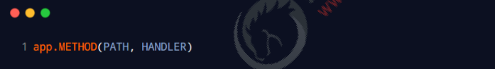

# 目标

- 能够知道如何使用Express中的路由
- 能够说出Express的中间件分为哪五大类
- 能够知道在Express中如何定义全局和局部的中间件
- 能够知道如何在Express中使用中间件
- 能够知道如何在Express中编写接口

# 路由的概念

## 1. 什么是路由

广义上来讲，路由就是映射关系。

## 2. 现实生活中的路由


## 3. Express 中的路由

在 Express 中，路由指的是客户端的请求与服务器处理函数之间的映射关系。
Express 中的路由分3 部分组成，分别是请求的类型、请求的URL 地址、处理函数，格式如下：



## 4. Express 中的路由的例子

```js
// 挂载路由
app.get('/', (req, res) => {
  res.send('hello world.')
})
app.post('/', (req, res) => {
  res.send('Post Request.')
})
```

## 5. 路由的匹配过程

每当一个请求到达服务器之后，需要先经过路由的匹配，只有匹配成功之后，才会调用对应的处理函数。
在匹配时，会按照路由的顺序进行匹配，如果请求类型和请求的URL 同时匹配成功，则Express 会将这次请求，转 交给对应的 function 函数进行处理。


# 路由的使用

## 1. 最简单的用法

在 Express 中使用路由最简单的方式，就是把路由挂载到app 上，示例代码如下：

```js
const express = require('express')
const app = express()

// 挂载路由
app.get('/', (req, res) => {
  res.send('hello world.')
})
app.post('/', (req, res) => {
  res.send('Post Request.')
})

app.listen(80, () => {
  console.log('http://127.0.0.1')
})

```

##  2. 模块化路由

为了方便对路由进行模块化的管理，Express 不建议将路由直接挂载到app 上，而是推荐将路由抽离为单独的模块。
将路由抽离为单独模块的步骤如下：
**① 创建路由模块对应的 .js 文件**
**② 调用 express.Router() 函数创建路由对象**
**③ 向路由对象上挂载具体的路由**
**④ 使用 module.exports 向外共享路由对象**
**⑤ 使用 app.use() 函数注册路由模块**

## 3. 创建路由模块

```js
// 1. 导入 express
const express = require('express')
// 2. 创建路由对象
const router = express.Router()

// 3. 挂载具体的路由
router.get('/user/list', (req, res) => {
  res.send('Get user list.')
})
router.post('/user/add', (req, res) => {
  res.send('Add new user.')
})

// 4. 向外导出路由对象
module.exports = router

```

## 4. 注册路由模块

```js
// 1. 导入路由模块
const router = require('./03.router')
// 2. 注册路由模块
app.use(router)
```

## 5. 为路由模块添加前缀

类似于托管静态资源时，为静态资源统一挂载访问前缀一样，路由模块添加前缀的方式也非常简单：

```js
// 1. 导入路由模块
const router = require('./03.router')
// 2. 注册路由模块
app.use('/api', router)

```

# 中间件的概念

## 1. 什么是中间件

中间件（Middleware ），特指业务流程的中间处理环节。

## 2. 现实生活中的例子

在处理污水的时候，一般都要经过三个处理环节，从而保证处理过后的废水，达到排放标准。


## 3.Express 中间件的调用流程

当一个请求到达 Express 的服务器之后，可以连续调用多个中间件，从而对这次请求进行预处理。


## 4. Express 中间件的格式


#  Express 中间件的初体验

## 1. 局部生效的中间件


## 2. 全局生效的中间件

通过调用 app.use(中间件函数)，即可注册一个全局生效的中间件，示例代码如下：


## 3.了解中间件的使用注意事项

① 一定要在路由之前注册中间件
**② 客户端发送过来的请求，可以连续调用多个中间件进行处理**
**③ 执行完中间件的业务代码之后，不要忘记调用next() 函数**
**④ 为了防止代码逻辑混乱，调用next() 函数后不要再写额外的代码**
**⑤ 连续调用多个中间件时，多个中间件之间，共享 req 和 res 对象**

# 中间件的分类

为了方便大家理解和记忆中间件的使用，Express 官方把常见的中间件，分成了5 大类，分别是：
**① 应用级别的中间件**
**② 路由级别的中间件**
**③ 错误级别的中间件**
**④ Express 内置的中间件**
**⑤ 第三方的中间件**


## 1.应用级别的中间件

通过 app.use() 或 app.METHOD() 函数，绑定到app 实例上的中间件，叫做应用级别的中间件，代码示例如下


## 2. 路由级别的中间件

绑定到 express.Router() 实例上的中间件，叫做路由级别的中间件。它的用法和应用级别中间件没有任何区别。只不 过，应用级别中间件是绑定到 app 实例上，路由级别中间件绑定到router 实例上，代码示例如下：


## 3. 错误级别的中间件

错误级别的中间件function 处理函数，必须有4 个形参，形参顺序从前到后，分别是(err, req, res, next)。


## 4. Express内置的中间件

自 Express 4.16.0 版本开始，Express 内置了 3 个常用的中间件，极大的提高了Express 项目的开发效率和体验：
**① express.static快速托管静态资源的内置中间件，例如：HTML 文件、图片、CSS 样式等（无兼容性）**
**② express.json解析 JSON 格式的请求体数据（有兼容性，仅在4.16.0+ 版本中可用）**
**③ express.urlencoded 解析 URL-encoded 格式的请求体数据（有兼容性，仅在4.16.0+ 版本中可用）**


## 5. 第三方的中间件

非 Express 官方内置的中间件，而是由第三方开发出来的Express 中间件，叫做第三方中间件。在项目中，大家可以 按需下载并配置第三方中间件，从而提高项目的开发效率。
例如：除了使用 express.urlencoded 这个内置中间件来解析请求体数据，还可以使用body-parser 这个第三方中间 件，来解析请求体数据。使用步骤如下：
**① 运行 npm install body-parser安装中间件**
**② 使用 require 导入中间件**
**③ 调用 app.use() 注册并使用中间件**
注意：Express 内置的 express.urlencoded中间件，就是基于body-parser 这个第三方中间件进一步封装出来的。

# 自定义中间件

## 1. 需求描述与实现步骤

自己手动模拟一个类似于 express.urlencoded这样的中间件，来解析POST 提交到服务器的表单数据。
实现步骤：
**① 定义中间件**
**② 监听 req 的 data 事件**
**③ 监听 req 的 end 事件**
**④ 使用 querystring 模块解析请求体数据**
**⑤ 将解析出来的数据对象挂载为 req.body**
**⑥ 将自定义中间件封装为模块**

## 2. 定义中间件

使用 app.use() 来定义全局生效的中间件，代码如下：


## 3. 监听 req 的 data 事件

```js
// 1. 定义一个 str 字符串，专门用来存储客户端发送过来的请求体数据
  let str = ''
  // 2. 监听 req 的 data 事件
  req.on('data', (chunk) => {
    str += chunk
  })
```

## 4. 监听 req 的 end 事件

当客户端最终把所有数据发送到服务器之后，会自动触发 req 的 end 事件。
因此，我们可以在req 的 end 事件中，拿到并处理完整的请求体数据。示例代码如下：

```js
req.on('end', () => {
    // 在 str 中存放的是完整的请求体数据
     console.log(str)
})
```

## 5. 使用 querystring 模块解析请求体数据

Node.js 内置了一个querystring 模块，专门用来处理查询字符串。通过这个模块提供的 parse() 函数，可以轻松把 查询字符串，解析成对象的格式。示例代码如下：

```js
// 导入 Node.js 内置的 querystring 模块
const qs = require('querystring')

const body = qs.parse(str)
```

## 6. 将解析出来的数据对象挂载为 req.body

为了方便在后续的业务处理流程中，能够直接访问当前中间件解析出来的请求体对象，我们将解析出来的数据，挂载 为 req 的自定义属性，命名为req.body。示例代码如下：

```js
// 3. 监听 req 的 end 事件
  req.on('end', () => {
    // 在 str 中存放的是完整的请求体数据
    // console.log(str)
    // TODO: 把字符串格式的请求体数据，解析成对象格式
    const body = qs.parse(str)
    req.body = body
    next()
  })
```

## 7. 将自定义中间件封装为模块

为了优化代码的结构，我们可以把自定义的中间件函数，封装为独立的模块，示例代码如下：

```js
// 导入 Node.js 内置的 querystring 模块
const qs = require('querystring')

const bodyParser = (req, res, next) => {
  // 定义中间件具体的业务逻辑
  // 1. 定义一个 str 字符串，专门用来存储客户端发送过来的请求体数据
  let str = ''
  // 2. 监听 req 的 data 事件
  req.on('data', (chunk) => {
    str += chunk
  })
  // 3. 监听 req 的 end 事件
  req.on('end', () => {
    // 在 str 中存放的是完整的请求体数据
    // console.log(str)
    // TODO: 把字符串格式的请求体数据，解析成对象格式
    const body = qs.parse(str)
    req.body = body
    next()
  })
}

module.exports = bodyParser

```

# 使用 Express 写接口

## 1.创建基本的服务器

```js
// 导入 express
const express = require('express')
// 创建服务器实例
const app = express()


// 启动服务器
app.listen(80, () => {
  console.log('express server running at http://127.0.0.1')
})

```

## 2.创建 API 路由模块


## 3 编写 GET 接口


## 4.编写 POST 接口


注意：如果要获取URL-encoded 格式的请求体数据，必须配置中间件 app.use(express.urlencoded({ extended: false }))

# CORS 跨域资源共享

## 1. 接口的跨域问题

刚才编写的 GET 和 POST接口，存在一个很严重的问题：不支持跨域请求。
解决接口跨域问题的方案主要有两种：
**① CORS（主流的解决方案，推荐使用）**
**② JSONP（有缺陷的解决方案：只支持GET 请求）**

## 2. 使用 cors 中间件解决跨域问题

cors 是 Express 的一个第三方中间件。通过安装和配置cors 中间件，可以很方便地解决跨域问题。
使用步骤分为如下3 步：
**① 运行 npm install cors 安装中间件**
**② 使用 const cors = require('cors') 导入中间件**
**③ 在路由之前调用 app.use(cors()) 配置中间件**

## 3. 什么是 CORS

CORS （Cross-Origin Resource Sharing，跨域资源共享）由一系列传输的HTTP 头组成，这些HTTP 头决定浏 览器是否阻止前端JavaScript 代码获取跨域请求的响应。

同源安全策略默认阻止“跨域”获取资源。但是CORS 给了 web 服务器这样的权限，即服务器可以选择，允许跨 域请求访问到它们的资源。

## 4. CORS 的注意事项

① CORS 主要在服务器端进行配置。客户端浏览器无须做任何额外的配置，即可请求开启了 CORS 的接口。
② CORS 在浏览器中有兼容性。只有支持XMLHttpRequest Level2 的浏览器，才能正常访问开启了 CORS 的服 务端接口（例如：IE10+、Chrome4+、FireFox3.5+）。

## 5. CORS 响应头部 - Access-Control-Allow-Origin 

响应头部中可以携带一个 Access-Control-Allow-Origin字段，其语法如下:


其中，origin 参数的值指定了允许访问该资源的外域URL。
例如，下面的字段值将只允许来自 http://itcast.cn 的请求：


## 5. CORS 响应头部 - Access-Control-Allow-Origin

如果指定了 Access-Control-Allow-Origin 字段的值为通配符*，表示允许来自任何域的请求，示例代码如下：


## 6. CORS 响应头部 - Access-Control-Allow-Headers

默认情况下，CORS 仅支持客户端向服务器发送如下的9 个请求头：
Accept、Accept-Language、Content-Language、DPR、Downlink、Save-Data、Viewport-Width、Width 、 Content-Type （值仅限于 text/plain、multipart/form-data、application/x-www-form-urlencoded 三者之一）
如果客户端向服务器发送了额外的请求头信息，则需要在服务器端，通过Access-Control-Allow-Headers 对额外 的请求头进行声明，否则这次请求会失败！


## 7. CORS 响应头部 - Access-Control-Allow-Methods

默认情况下，CORS 仅支持客户端发起GET、POST、HEAD 请求。
如果客户端希望通过 PUT、DELETE等方式请求服务器的资源，则需要在服务器端，通过Access-Control-Alow-Methods 来指明实际请求所允许使用的 HTTP 方法。
示例代码如下


## 8. 简单请求

同时满足以下两大条件的请求，就属于简单请求：
① 请求方式：GET、POST、HEAD 三者之一
② HTTP 头部信息不超过以下几种字段：无自定义头部字段、Accept、Accept-Language、Content-Language、DPR、 Downlink、Save-Data、Viewport-Width、Width 、Content-Type（只有三个值application/x-www-formurlencoded、multipart/form-data、text/plain）

**简单请求的特点**：客户端与服务器之间只会发生一次请求。

## 9. 预检请求

只要符合以下任何一个条件的请求，都需要进行预检请求：
**① 请求方式为 GET、POST、HEAD 之外的请求Method 类型**
**② 请求头中包含自定义头部字段**
**③ 向服务器发送了application/json 格式的数据**
在浏览器与服务器正式通信之前，浏览器会先发送OPTION 请求进行预检，以获知服务器是否允许该实际请求，所以这一 次的 OPTION 请求称为“预检请求”。服务器成功响应预检请求后，才会发送真正的请求，并且携带真实数据。
预检请求的特点：OPTION 预检请求成功之后，才会发起真正的请求。

#  JSONP 接口

## 1. 回顾 JSONP 的概念与特点

概念：浏览器端通过 <script> 标签的 src 属性，请求服务器上的数据，同时，服务器返回一个函数的调用。这种请求数据 的方式叫做 JSONP。
特点：JSONP 仅支持 GET 请求，不支持POST、PUT、DELETE 等请求。

## 2. 创建 JSONP 接口的注意事项

如果项目中已经配置了 CORS 跨域资源共享，为了防止冲突，必须在配置CORS 中间件之前声明JSONP的接口。否则 JSONP 接口会被处理成开启了CORS 的接口。示例代码如下：


## 3. 在网页中使用 jQuery 发起 JSONP 请求


## 4. 实现 JSONP 接口的步骤

**① 获取客户端发送过来的回调函数的名字**
**② 得到要通过 JSONP 形式发送给客户端的数据**
**③ 根据前两步得到的数据，拼接出一个函数调用的字符串**
**④ 把上一步拼接得到的字符串，响应给客户端的<script> 标签进行解析执行**

## 5. 实现 JSONP 接口的具体代码

