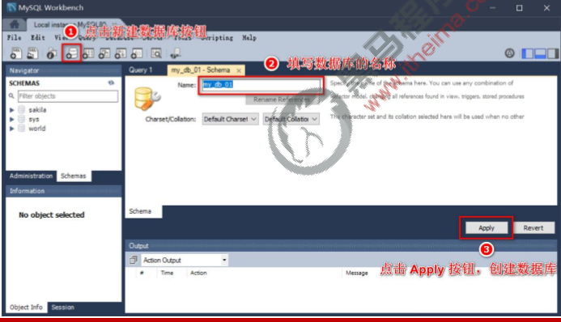
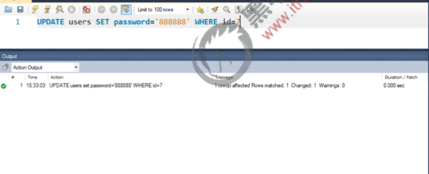

# 目标

- 能够安装和配置MySQL数据库的环境
- 能够了解常用的SQL语句的语法格式
- 能够知道如何安装与配置mysql模块
- 能够知道如何使用mysql模块执行SQL语句

# 数据库的基本概念

## 1. 什么是数据库

数据库（database）是用来组织、存储和管理数据的仓库。

当今世界是一个充满着数据的互联网世界，充斥着大量的数据。数据的来源有很多，比如出行记录、消费记录、 浏览的网页、发送的消息等等。除了文本类型的数据，图像、音乐、声音都是数据。

为了方便管理互联网世界中的数据，就有了数据库管理系统的概念（简称：数据库）。用户可以对数据库中的数 据进行新增、查询、更新、删除等操作。

## 2.常见的数据库及分类

市面上的数据库有很多种，最常见的数据库有如下几个：

- MySQL数据库（目前使用最广泛、流行度最高的开源免费数据库；Community + Enterprise）

- Oracle 数据库（收费）

-  SQL Server 数据库（收费）

- Mongodb 数据库（Community + Enterprise）

  

  **其中，MySQL、Oracle、SQL Server 属于传统型数据库（又叫做：关系型数据库或 SQL 数据库），这三者的 设计理念相同，用法比较类似。**

  **而 Mongodb 属于新型数据库（又叫做：非关系型数据库或 NoSQL 数据库），它在一定程度上弥补了传统型 数据库的缺陷。**

## 3.传统型数据库的数据组织结构


## 4.实际开发中库、表、行、字段的关系

**① 在实际项目开发中，一般情况下，每个项目都对应独立的数据库。**
**② 不同的数据，要存储到数据库的不同表中，例如：用户数据存储到users 表中，图书数据存储到books 表中。**
**③ 每个表中具体存储哪些信息，由字段来决定，例如：我们可以为users 表设计 id、username、password 这 3 个 字段。**
**④ 表中的行，代表每一条具体的数据。**


# 安装与配置mysql

## 1.了解需要安装哪些MySQL相关的软件

对于开发人员来说，只需要安装MySQL Server 和 MySQL Workbench 这两个软件，就能满足开发的需要了。

- MySQL Server：专门用来提供数据存储和服务的软件。
- MySQL Workbench：可视化的MySQL 管理工具，通过它，可以方便的操作存储在MySQL Server 中的数据。

## 2. MySQL 在 Mac 环境下的安装

在 Mac 环境下安装MySQL的过程比 Windows 环境下的步骤简单很多：

① 先运行 mysql-8.0.19-macos10.15-x86_64.dmg 这个安装包，将MySQL Server 安装到 Mac 系统

② 再运行 mysql-workbench-community-8.0.19-macos-x86_64.dmg 这个安装包，将可视化的MySQL Workbench 工具安装到 Mac 系统

**具体的安装教程，可以参考 素材 -> MySQL for Mac ->安装教程- Mac系统安装MySql-> README.md**

## 3.MySQL 在 Windows 环境下的安装

在 Windows 环境下安装 MySQL，只需要运行 mysql-installer-community-8.0.19.0.msi 这个安装包，就能一次 性将 MySQL Server  和 MySQL Workbench 安装到自己的电脑上。
**具体的安装教程，可以参考 素材 -> MySQL for Windows ->安装教程 - Windows系统安装MySql-> README.md** 


#  MySQL 的基本使用

## 1.使用 MySQL Workbench 管理数据库

1. 连接数据库

   

2. 了解主界面的组成部分


3. 创建数据库



4. 创建数据表


5. 向表中写入数据


# 使用 SQL 管理数据库

## 1. 什么是 SQL

SQL（英文全称：Structured Query Language）是结构化查询语言，专门用来访问和处理数据库的编程语言。能够让 我们以编程的形式，操作数据库里面的数据。
三个关键点：
**① SQL 是一门数据库编程语言**
**② 使用 SQL 语言编写出来的代码，叫做SQL 语句**
**③ SQL 语言只能在关系型数据库中使用（例如 MySQL、Oracle、SQL Server）。非关系型数据库（例如 Mongodb） 不支持 SQL 语言**

## 2.SQL 能做什么

**① 从数据库中查询数据**
**② 向数据库中插入新的数据**
**③ 更新数据库中的数据**
**④ 从数据库删除数据**
**⑤ 可以创建新数据库**
**⑥ 可在数据库中创建新表**
**⑦ 可在数据库中创建存储过程、视图**
**⑧ etc…**

## 3. SQL 的学习目标

重点掌握如何使用SQL 从数据表中：
**查询数据（select）、插入数据（insert into） 、更新数据（update）、删除数据（delete）**
额外需要掌握的 4 种 SQL 语法：
**where 条件、and 和 or 运算符、order by 排序、count(*) 函数**


# SELECT 语句

## 1. 语法

SELECT 语句用于从表中查询数据。执行的结果被存储在一个结果表中（称为结果集）。语法格式如下


注意：SQL 语句中的关键字对大小写不敏感。SELECT 等效于 select，FROM 等效于 from

## 2. SELECT * 示例

我们希望从 users 表中选取所有的列，可以使用符号 * 取代列的名称，示例如下：


```sql
select * from users
```

## 3. SELECT 列名称 示例

如需获取名为"username" 和 "password" 的列的内容（从名为 "users" 的数据库表），请使用下面的SELECT 语句：


```sql
select username , password from users
```


# INSERT INTO 语句

## 1.语法

INSERT INTO 语句用于向数据表中插入新的数据行，语法格式如下：


## 2. INSERT INTO 示例

向 users 表中，插入一条 username 为 tony stark，password为 098123的用户数据，示例如下：


```sql
insert into users (username,password) values ('tony stark','098123')
```


#  UPDATE 语句

## 1. 语法

Update 语句用于修改表中的数据。语法格式如下：


## 2. UPDATE 示例 - 更新某一行中的一个列

把 users 表中 id 为 7 的用户密码，更新为888888。示例如下：



```sql
update users set password ='888888' where id = 7;
```

## 3. UPDATE 示例 - 更新某一行中的若干列

把 users 表中 id 为 2 的用户密码和用户状态，分别更新为admin123 和 1。示例如下：


```sql
update users set password = "admin", status=1 where id = 2
```

#  DELETE 语句

## 1. 语法

DELETE 语句用于删除表中的行。语法格式如下：


## 2. DELETE 示例

从 users 表中，删除 id 为 4 的用户，示例如下


```sql
delete from users where id = 4
```

# WHERE 子句

## 1. 语法

WHERE 子句用于限定选择的标准。在 SELECT、UPDATE、DELETE 语句中，皆可使用 WHERE 子句来限定选择的标准。


## 2. 可在 WHERE 子句中使用的运算符

下面的运算符可在WHERE 子句中使用，用来限定选择的标准：


## 3. WHERE 子句示例

可以通过 WHERE 子句来限定 SELECT 的查询条件：


```sql
select * from users where status = 1

select * from users where  id > 2

select * from users where  username <> 'admin'
```


#  AND 和 OR 运算符

## 1. 语法

**AND 和 OR 可在 WHERE 子语句中把两个或多个条件结合起来。**
**AND 表示必须同时满足多个条件，相当于JavaScript 中的 && 运算符，例如if (a !== 10 && a !== 20)**
**OR 表示只要满足任意一个条件即可，相当于JavaScript 中的 || 运算符，例如if(a !== 10 || a !== 20)**


## 2. AND 运算符示例

使用 AND 来显示所有 status 为 0，并且 id 小于 3 的用户：


```sql
select * from users where status=0 and id < 3
```

## 2. OR 运算符示例

使用 OR 来显示所有 status 为 1，或者 username 为 zs 的用户：


```sql
select * from users where status=1 or username='zs'
```

# ORDER BY 子句

## 1. 语法

**ORDER BY 语句用于根据指定的列对结果集进行排序。**
**ORDER BY 语句默认按照升序对记录进行排序。**
**如果您希望按照降序对记录进行排序，可以使用DESC 关键字。**

## 2. ORDER BY 子句 - 升序排序

对 users 表中的数据，按照status 字段进行升序排序，示例如下：


```sql
select * from users order by status;
select * from users order by status asc;
```

## 3. ORDER BY 子句 – 降序排序

对 users 表中的数据，按照id 字段进行降序排序，示例如下：


```sql
select * from users order by id desc;
```

## 4. ORDER BY 子句 – 多重排序

对 users 表中的数据，先按照 status 字段进行降序排序，再按照username 的字母顺序，进行升序排序，示例如下：


```sql
select * from users order by status desc, username asc;
```

#  COUNT(*) 函数

## 1. 语法

COUNT(*) 函数用于返回查询结果的总数据条数，语法格式如下：


## 2. COUNT(*) 示例

查询 users 表中 status 为 0 的总数据条数：


```sql
select count(*) from users where status = 0
```

## 3.使用 AS 为列设置别名

如果希望给查询出来的列名称设置别名，可以使用AS 关键字，示例如下：


```sql
select count(*) as total from users where status = 0
```


#  在项目中操作 MySQL

## 1 在项目中操作数据库的步骤

**① 安装操作 MySQL 数据库的第三方模块（mysql）**
**② 通过 mysql 模块连接到 MySQL 数据库**
**③ 通过 mysql 模块执行 SQL 语句**


## 2 安装与配置 mysql 模块

### 1.安装 mysql 模块

mysql 模块是托管于npm 上的第三方模块。它提供了在Node.js 项目中连接和操作MySQL 数据库的能力。
想要在项目中使用它，需要先运行如下命令，将mysql 安装为项目的依赖包：

```shell
npm install mysql
```

### 2. 配置 mysql 模块

在使用 mysql 模块操作 MySQL 数据库之前，必须先对 mysql模块进行必要的配置，主要的配置步骤如下：

```js
// 1. 导入 mysql 模块
const mysql = require('mysql')
// 2. 建立与 MySQL 数据库的连接关系
const db = mysql.createPool({
  host: '127.0.0.1', // 数据库的 IP 地址
  user: 'root', // 登录数据库的账号
  password: 'admin123', // 登录数据库的密码
  database: 'my_db_01', // 指定要操作哪个数据库
})
```

### 3. 测试 mysql 模块能否正常工作

调用 db.query() 函数，指定要执行的 SQL 语句，通过回调函数拿到执行的结果：

```js
// 测试 mysql 模块能否正常工作
db.query('select 1', (err, results) => {
  // mysql 模块工作期间报错了
  if(err) return console.log(err.message)
  // 能够成功的执行 SQL 语句
  console.log(results)
})
```

# 使用 mysql 模块操作 MySQL 数据库

## 1. 查询数据

查询 users 表中所有的数据：

```js
// 查询 users 表中所有的数据
const sqlStr = 'select * from users'
db.query(sqlStr, (err, results) => {
  // 查询数据失败
  if (err) return console.log(err.message)
  // 查询数据成功
  // 注意：如果执行的是 select 查询语句，则执行的结果是数组
  console.log(results)
})
```

## 2. 插入数据

向 users 表中新增数据， 其中 username 为 Spider-Man，password为 pcc321。示例代码如下：

```js
const user = { username: 'Spider-Man', password: 'pcc123' }
// 定义待执行的 SQL 语句
const sqlStr = 'insert into users (username, password) values (?, ?)'
// 执行 SQL 语句
db.query(sqlStr, [user.username, user.password], (err, results) => {
  // 执行 SQL 语句失败了
  if (err) return console.log(err.message)
  // 成功了
  // 注意：如果执行的是 insert into 插入语句，则 results 是一个对象
  // 可以通过 affectedRows 属性，来判断是否插入数据成功
  if (results.affectedRows === 1) {
    console.log('插入数据成功!')
  }
})
```

插入数据的便捷方式:

```js
const user = { username: 'Spider-Man2', password: 'pcc4321' }
// 定义待执行的 SQL 语句
const sqlStr = 'insert into users set ?'
// 执行 SQL 语句
db.query(sqlStr, user, (err, results) => {
  if (err) return console.log(err.message)
  if (results.affectedRows === 1) {
    console.log('插入数据成功')
  }
})
```

## 3. 更新数据

可以通过如下方式，更新表中的数据：

```js
const user = { id: 6, username: 'aaa', password: '000' }
// 定义 SQL 语句
const sqlStr = 'update users set username=?, password=? where id=?'
// 执行 SQL 语句
db.query(sqlStr, [user.username, user.password, user.id], (err, results) => {
  if (err) return console.log(err.message)
  // 注意：执行了 update 语句之后，执行的结果，也是一个对象，可以通过 affectedRows 判断是否更新成功
  if (results.affectedRows === 1) {
    console.log('更新成功')
  }
})
```

更新数据的便捷方式:

更新表数据时，如果数据对象的每个属性和数据表的字段一一对应，则可以通过如下方式快速更新表数据：

```js
const user = { id: 6, username: 'aaaa', password: '0000' }
// 定义 SQL 语句
const sqlStr = 'update users set ? where id=?'
// 执行 SQL 语句
db.query(sqlStr, [user, user.id], (err, results) => {
  if (err) return console.log(err.message)
  if (results.affectedRows === 1) {
    console.log('更新数据成功')
  }
})
```

## 4. 删除数据

在删除数据时，推荐根据 id 这样的唯一标识，来删除对应的数据。示例如下：

```js
const sqlStr = 'delete from users where id=?'
db.query(sqlStr, 5, (err, results) => {
  if (err) return console.log(err.message)
  // 注意：执行 delete 语句之后，结果也是一个对象，也会包含 affectedRows 属性
  if (results.affectedRows === 1) {
    console.log('删除数据成功')
  }
})
```

## 5. 标记删除

使用 DELETE 语句，会把真正的把数据从表中删除掉。为了保险起见，推荐使用标记删除的形式，来模拟删除的动作。
**所谓的标记删除，就是在表中设置类似于status 这样的状态字段，来标记当前这条数据是否被删除。**
**当用户执行了删除的动作时，我们并没有执行DELETE 语句把数据删除掉，而是执行了UPDATE 语句，将这条数据对应 的 status 字段标记为删除即可。**

```js
// 标记删除
const sqlStr = 'update users set status=? where id=?'
db.query(sqlStr, [1, 6], (err, results) => {
  if (err) return console.log(err.message)
  if (results.affectedRows === 1) {
    console.log('标记删除成功')
  }
})

```

