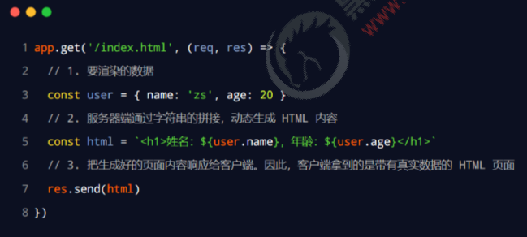
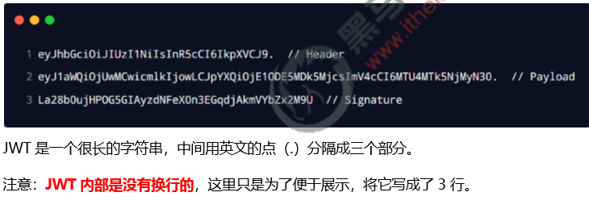

# 目标

- 能够说出Session认证的工作原理
- 能够说出JWT认证的工作原理

#  Web 开发模式

目前主流的 Web 开发模式有两种，分别是：
**① 基于服务端渲染的传统Web 开发模式**
**② 基于前后端分离的新型Web 开发模式**

## 1. 服务端渲染的 Web 开发模式

服务端渲染的概念：服务器发送给客户端的HTML 页面，是在服务器通过字符串的拼接，动态生成的。因此，客户端不 需要使用 Ajax 这样的技术额外请求页面的数据。代码示例如下：



## 2. 服务端渲染的优缺点

**优点：**
① 前端耗时少。因为服务器端负责动态生成HTML 内容，浏览器只需要直接渲染页面即可。尤其是移动端，更省电。
② 有利于SEO。因为服务器端响应的是完整的HTML 页面内容，所以爬虫更容易爬取获得信息，更有利于SEO。

**缺点：**
① 占用服务器端资源。即服务器端完成HTML 页面内容的拼接，如果请求较多，会对服务器造成一定的访问压力。
② 不利于前后端分离，开发效率低。使用服务器端渲染，则无法进行分工合作，尤其对于前端复杂度高的项目，不利于 项目高效开发。

## 3. 前后端分离的 Web 开发模式

前后端分离的概念：前后端分离的开发模式，依赖于Ajax 技术的广泛应用。即后端不提供完整的 HTML 页面内容，而 是提供一些 API 接口，使得前端可以获取到json 数据；然后前端通过 Ajax 调用后端提供的API 接口，拿到 json 数据 之后再在前端进行HTML 页面的拼接，最终展示在浏览器上。
**简而言之，前后端分离的 Web 开发模式，就是后端只负责提供API 接口，前端使用Ajax 调用接口的开发模式。**


## 4. 前后端分离的优缺点

**优点：**
① 开发体验好。前端专注于 UI 页面的开发，后端专注于api的开发，且前端有更多的选择性。
② 用户体验好。Ajax 技术的广泛应用，极大的提高了用户的体验，可以轻松实现页面的局部刷新。
③ 减轻了服务器端的渲染压力。因为页面最终是在每个用户的浏览器中生成的。
**缺点：**
① 不利于 SEO。因为完整的 HTML 页面需要在客户端动态拼接完成，所以爬虫对无法爬取页面的有效信息。（解决方 案：利用 Vue、React 等前端框架的SSR （server side render）技术能够很好的解决 SEO 问题！）

## 5. 如何选择 Web 开发模式

不谈业务场景而盲目选择使用何种开发模式都是耍流氓。

- 比如企业级网站，主要功能是展示而没有复杂的交互，并且需要良好的SEO，则这时我们就需要使用服务器端渲染；
-  而类似后台管理页面，交互性比较强，不需要SEO 的考虑，那么就可以使用前后端分离的开发模式。
- 另外，具体使用何种开发模式并不是绝对的，为了同时兼顾了首页的渲染速度和前后端分离的开发效率，一些网站采用了 首屏服务器端渲染，即对于用户最开始打开的那个页面采用的是服务器端渲染，而其他的页面采用前后端分离开发模式。

# 身份认证

## 1.什么是身份认证

身份认证（Authentication）又称“身份验证”、“鉴权”，是指通过一定的手段，完成对用户身份的确认。

- 日常生活中的身份认证随处可见，例如：高铁的验票乘车，手机的密码或指纹解锁，支付宝或微信的支付密码等。
- 在 Web 开发中，也涉及到用户身份的认证，例如：各大网站的手机验证码登录、邮箱密码登录、二维码登录等。

## 2. 为什么需要身份认证

身份认证的目的，是为了确认当前所声称为某种身份的用户，确实是所声称的用户。例如，你去找快递员取快递，你要怎 么证明这份快递是你的。

在互联网项目开发中，如何对用户的身份进行认证，是一个值得深入探讨的问题。例如，如何才能保证网站不会错误的将 “马云的存款数额”显示到“马化腾的账户”上。

## 3. 不同开发模式下的身份认证

对于服务端渲染和前后端分离这两种开发模式来说，分别有着不同的身份认证方案：
**① 服务端渲染推荐使用 Session 认证机制**
**② 前后端分离推荐使用JWT 认证机制**

# Session 认证机制

## 1. HTTP 协议的无状态性

在具体了解如何使用 Session 进行用户的身份认证之前，我们需要先了解什么是HTTP 协议的无状态性。
HTTP 协议的无状态性，指的是每次的HTTP 请求都是独立的，连续多个HTTP 请求之间没有直接的关系，**服务器不会 主动保留每次HTTP 请求的状态。**


## 2. 如何突破 HTTP 无状态的限制

对于超市来说，为了方便收银员在进行结算时给VIP 用户打折，超市可以为每个VIP 用户发放会员卡。


## 3. 什么是 Cookie

Cookie 是存储在用户浏览器中的一段不超过4 KB 的字符串。它由一个名称（Name）、一个值（Value）和其它几个用 于控制 Cookie 有效期、安全性、使用范围的可选属性组成。

不同域名下的 Cookie 各自独立，每当客户端发起请求时，会自动把当前域名下所有未过期的 Cookie 一同发送到服务器。

**Cookie的几大特性：**
**① 自动发送**
**② 域名独立**
**③ 过期时限**
**④ 4KB 限制**

## 4. Cookie 在身份认证中的作用

客户端第一次请求服务器的时候，服务器通过响应头的形式，向客户端发送一个身份认证的Cookie，客户端会自动 将 Cookie 保存在浏览器中。

随后，当客户端浏览器每次请求服务器的时候，浏览器会自动将身份认证相关的Cookie，通过请求头的形式发送给 服务器，服务器即可验明客户端的身份。


## 5. Cookie 不具有安全性

由于 Cookie 是存储在浏览器中的，而且浏览器也提供了读写Cookie 的 API，因此Cookie 很容易被伪造，不具有安全 性。因此不建议服务器将重要的隐私数据，通过Cookie 的形式发送给浏览器。


## 6. 提高身份认证的安全性

为了防止客户伪造会员卡，收银员在拿到客户出示的会员卡之后，可以在收银机上进行刷卡认证。只有收银机确认存在的 会员卡，才能被正常使用。


## 7. 了解 Session 的工作原理


# 在 Express 中使用 Session 认证

## 1. 安装 express-session 中间件

在 Express 项目中，只需要安装 express-session 中间件，即可在项目中使用Session：

```shell
npm install express-session
```

## 2. 配置 express-session 中间件

express-session 中间件安装成功后，需要通过app.use() 来注册 session 中间件，示例代码如下：

```js
const session = require('express-session')
app.use(
  session({
    secret: 'itheima',
    resave: false,
    saveUninitialized: true,
  })
)
```

## 3. 向 session 中存数据

当 express-session 中间件配置成功后，即可通过req.session 来访问和使用session 对象，存储用户的关键信息：

```js
// 登录的 API 接口
app.post('/api/login', (req, res) => {
  // 判断用户提交的登录信息是否正确
  if (req.body.username !== 'admin' || req.body.password !== '000000') {
    return res.send({ status: 1, msg: '登录失败' })
  }

  // TODO_02：请将登录成功后的用户信息，保存到 Session 中
  // 注意：只有成功配置了 express-session 这个中间件之后，才能够通过 req 点出来 session 这个属性
  req.session.user = req.body // 用户的信息
  req.session.islogin = true // 用户的登录状态

  res.send({ status: 0, msg: '登录成功' })
})
```

## 4. 从 session 中取数据


也可以直接从req.session 对象上获取之前存储的数据，示例代码如下：

```js
// 获取用户姓名的接口
app.get('/api/username', (req, res) => {
  // TODO_03：请从 Session 中获取用户的名称，响应给客户端
  if (!req.session.islogin) {
    return res.send({ status: 1, msg: 'fail' })
  }
  res.send({
    status: 0,
    msg: 'success',
    username: req.session.user.username,
  })
})
```

## 5. 清空 session

调用 req.session.destroy() 函数，即可清空服务器保存的session 信息。

```js
// 退出登录的接口
app.post('/api/logout', (req, res) => {
  // TODO_04：清空 Session 信息
  req.session.destroy()
  res.send({
    status: 0,
    msg: '退出登录成功',
  })
})
```

# JWT 认证机制


## 1. 了解 Session 认证的局限性


**Session 认证机制需要配合 Cookie 才能实现。由于Cookie 默认不支持跨域访问，所以，当涉及前端跨域请求后端接口 的时候，需要做很多额外的配置，才能实现跨域Session 认证**。
注意：
⚫ 当前端请求后端接口不存在跨域问题的时候，推荐使用Session 身份认证机制。
⚫ 当前端需要跨域请求后端接口的时候，不推荐使用Session 身份认证机制，推荐使用JWT 认证机制。


## 2. 什么是 JWT

JWT（英文全称：JSON Web Token）是目前最流行的跨域认证解决方案。

## 3. JWT 的工作原理


## 4. JWT 的组成部分

JWT 通常由三部分组成，分别是 Header（头部）、Payload（有效荷载）、Signature（签名）。
三者之间使用英文的“.”分隔，格式如下：


## 5. JWT 的示例

下面是 JWT 字符串的示例：



## 6. JWT 的三个部分各自代表的含义

JWT 的三个组成部分，从前到后分别是 Header、Payload、Signature。
其中：
⚫ Payload 部分才是真正的用户信息，它是用户信息经过加密之后生成的字符串。
⚫ Header 和 Signature 是安全性相关的部分，只是为了保证Token 的安全性。

## 7. JWT 的使用方式


客户端收到服务器返回的 JWT 之后，通常会将它储存在localStorage 或 sessionStorage 中。
此后，客户端每次与服务器通信，都要带上这个JWT。推荐的做法是把 JWT 放在 HTTP 请求头的 Authorization 字段 中，格式如下：


# 在 Express 中使用 JWT

## 1. 安装 JWT 相关的包

运行如下命令，安装如下两个 JWT 相关的包：

```shell
npm install jsonwebtoken express-jwt
```


## 2. 导入 JWT 相关的包

使用 require() 函数，分别导入JWT 相关的两个包：

````js

// TODO_01：安装并导入 JWT 相关的两个包，分别是 jsonwebtoken 和 express-jwt
const jwt = require('jsonwebtoken')
const expressJWT = require('express-jwt')
````

## 3. 定义 secret 密钥

为了保证 JWT 字符串的安全性，防止JWT 字符串在网络传输过程中被别人破解，我们需要专门定义一个用于加密和解密 的 secret 密钥：
① 当生成 JWT 字符串的时候，需要使用secret 密钥对用户的信息进行加密，最终得到加密好的 JWT 字符串
② 当把 JWT 字符串解析还原成 JSON 对象的时候，需要使用secret 密钥进行解密

```js
// TODO_02：定义 secret 密钥，建议将密钥命名为 secretKey
const secretKey = 'itheima No1 ^_^'
```

## 4. 在登录成功后生成 JWT 字符串

调用 jsonwebtoken包提供的 sign() 方法，将用户的信息加密成JWT 字符串，响应给客户端：

```js

// 登录接口
app.post('/api/login', function (req, res) {
  // 将 req.body 请求体中的数据，转存为 userinfo 常量
  const userinfo = req.body
  // 登录失败
  if (userinfo.username !== 'admin' || userinfo.password !== '000000') {
    return res.send({
      status: 400,
      message: '登录失败！',
    })
  }
  // 登录成功
  // TODO_03：在登录成功之后，调用 jwt.sign() 方法生成 JWT 字符串。并通过 token 属性发送给客户端
  // 参数1：用户的信息对象
  // 参数2：加密的秘钥
  // 参数3：配置对象，可以配置当前 token 的有效期
  // 记住：千万不要把密码加密到 token 字符中
  const tokenStr = jwt.sign({ username: userinfo.username }, secretKey, { expiresIn: '30s' })
  res.send({
    status: 200,
    message: '登录成功！',
    token: tokenStr, // 要发送给客户端的 token 字符串
  })
})
```

## 5. 注册将 JWT 字符串还原为 JSON 对象的中间件

客户端每次在访问那些有权限接口的时候，都需要主动通过请求头中的Authorization 字段，将 Token 字符串发 送到服务器进行身份认证。
此时，服务器可以通过 express-jwt 这个中间件，自动将客户端发送过来的Token 解析还原成 JSON 对象:

```js
// TODO_04：注册将 JWT 字符串解析还原成 JSON 对象的中间件
// 注意：只要配置成功了 express-jwt 这个中间件，就可以把解析出来的用户信息，挂载到 req.user 属性上
app.use(expressJWT({ secret: secretKey }).unless({ path: [/^\/api\//] }))
```

## 6. 使用 req.user 获取用户信息

当 express-jwt 这个中间件配置成功之后，即可在那些有权限的接口中，使用req.user 对象，来访问从JWT 字符串 中解析出来的用户信息了，示例代码如下：

````js
// 这是一个有权限的 API 接口
app.get('/admin/getinfo', function (req, res) {
  // TODO_05：使用 req.user 获取用户信息，并使用 data 属性将用户信息发送给客户端
  console.log(req.user)
  res.send({
    status: 200,
    message: '获取用户信息成功！',
    data: req.user, // 要发送给客户端的用户信息
  })
})
````


## 7. 捕获解析 JWT 失败后产生的错误

当使用 express-jwt 解析 Token 字符串时，如果客户端发送过来的Token 字符串过期或不合法，会产生一个解析失败 的错误，影响项目的正常运行。我们可以通过 Express 的错误中间件，捕获这个错误并进行相关的处理，示例代码如下：

```js
// TODO_06：使用全局错误处理中间件，捕获解析 JWT 失败后产生的错误
app.use((err, req, res, next) => {
  // 这次错误是由 token 解析失败导致的
  if (err.name === 'UnauthorizedError') {
    return res.send({
      status: 401,
      message: '无效的token',
    })
  }
  res.send({
    status: 500,
    message: '未知的错误',
  })
})
```

