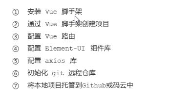
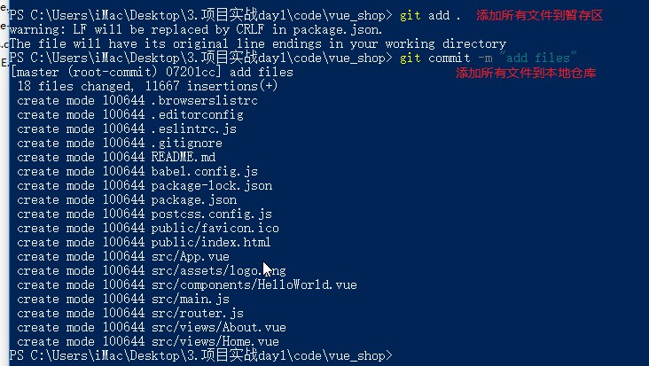
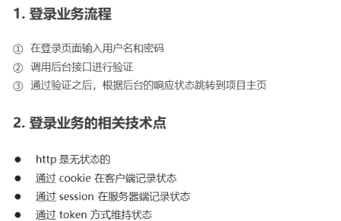
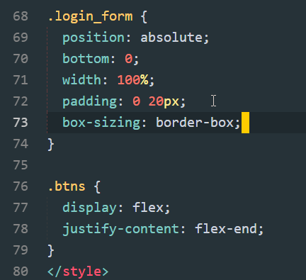
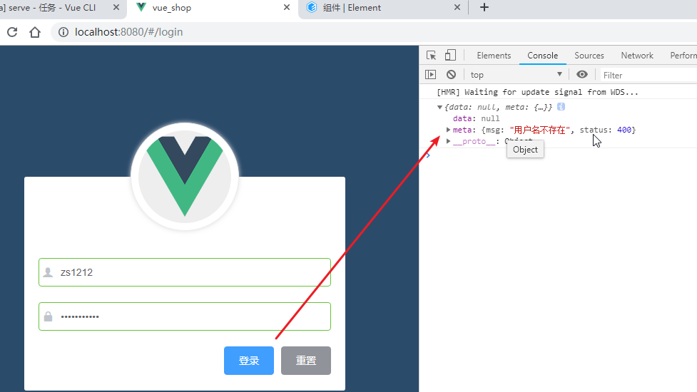
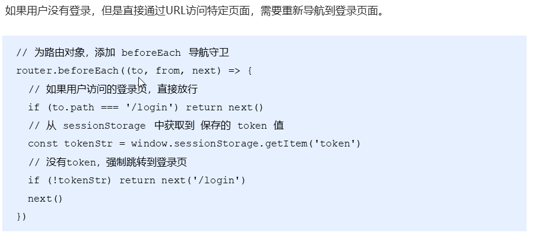

## Day03

###今日目标

1.初始化项目 

2.基于Vue技术栈进行项目开发

3.使用Vue的第三方组件进行项目开发

4.理解前后端分离开发模式

## 1. 项目概述

### 1.1 电商项目基本业务概述

- 介绍

  

- 电商系统提供了不同的终端，但是对于数据库和提供API接口的服务器是一样的

- 对于不同的终端，PC后台管理与其他终端又不一样

  - PC后台管理面向京东的工作人员（管理员），管理员可以操作商品，商品分类，查看销售报表等
  - 其他终端面向的是普通消费者

- 我们这个项目主要围绕着PC后台管理进行开发

### 1.2 电商后台管理系统的功能划分

- 功能介绍

  

- 项目功能展示

  - 登录界面

    

  - 02左侧菜单

    

  - 03用户列表管理

    

  - 04角色管理

    

  - 05权限管理

    

  - 06商品列表

    

  - 07分类参数

    

  - 08商品分类

    

  - 09订单管理

    

  - 10数据报表

    

### 1.3 项目的开发模式以及技术选型

- 电商后台管理系统的开发模式（前后端分离）

  

  - 前后端分离
    - 后端设计接口（如：设计了一个返回首页数据的接口）
    - 前端调用接口（如：调用这个接口，获取首页数据）
    - 前后端是两个项目，单独启动，url不一样，存在跨域请求

- 技术选型

  

## 2. 项目初始化

### 2.1 前端项目初始化

- 初始化步骤

  

- 通过vue ui来创建项目

  1. 目录

  

  2. 项目名称

  

  3. 配置选择

  

  4. 选择安装的功能（**选择四个，必须是四个**）

  

  5. 配置项(**选择ESLint+Standard config**)

  

  6. 保存配置信息

  

  7. 创建成功（看到项目管理界面）

  

  

  8. 配置Element-ui库

  - 进入插件---添加插件，然后搜索，进行安装 

  

  - 选中**vue-cli-plugin-element**(单击即可)，然后点击右下角安装
  - 安装成功之后，出现如下配置界面

  

  - 文件改动（直接点击继续）

  

  - 安装成功

  

  9. 配置axios

  - 进入依赖----安装依赖----搜索**axios**，进行**安装**

    

  - 安装完成

    

  10. 配置完成之后，项目可以启动，并且目录结构如下(目录结构不太一样，没有router.js而是有router/index.js)

      

  11. 第六第七步接下来说

### 2.2 创建码云账号并配置SSH公钥

- *码云*(gitee.com)是 OSCHINA.NET 推出的代码托管平台,支持 Git 和 SVN,提供免费的私有仓库托管 
- 代码托管，指的是我们的代码可以将代码交给他进行管理
- 项目开发，一般都是团队开发，每个人都需要编写代码，那么多人开发的代码如何合并，管理的？
- 通过码云这个平台

#### 2.2.1 注册登录码云账号

- 访问：<https://gitee.com/signup> 注册码云账号


- 注册成功之后，登陆进去

#### 2.2.2 配置公钥

1. 登陆之后，右上角头像找到设置，点击设置


2. 进入设置界面，点击SSH公钥，在这里我们需要提交一个公钥

   

   - 我们将代码交给码云管理，代码在上传和下载的过程中，需要加密，而加密方式采用的是ssh公私钥非对称加密
   - 这个加密方式，需要我们将自己电脑的公钥交给码云
   - 这里的公钥如何生成呢？
   - 可以访问：<https://gitee.com/help/articles/4181> ，查看如何生成公钥
   - 也可以直接看下边的步骤

3. 创建公私钥：

   - 执行命令ssh-keygen -t rsa -C "xxx@xxx.com"，邮箱换为自己的邮箱
   - 如下：

   

4. 打开公钥：

   - 上图中提示了公钥生成在：c:\Users\iMax/.ssh/id_rsa.pub（自己的目录肯定不是这个），找到并且打开

   - 打开之后，复制所有内容

     

5. 将公钥添加到码云中

   

6. 测试公钥：打开终端，输入命令ssh -T git@gitee.com

   

   - 提示：Hi xxx，说明公钥配置成功了，可用使用了
   - 首次使用需要确认并添加主机到本机SSH可信列表

### 2.3 将本地项目托管到码云中

1. 新建仓库-输入仓库名

   

2. 去掉readme勾选项

   

3. 创建成功界面

   

4. 进行git配置：

   

5. 项目关联git仓库：我们刚刚已经创建仓库，并且已经有项目了，所以采用第二种方式（但是在这一步之前需要先处理下一步，第6步）

   

6. 进入项目中，将项目提交到本地仓库

   

7. 关联远程码云仓库（确定本地代码都已经提交到本地仓库之后，再关联）

   - 执行如下命令

     

   - 执行push的时候，需要输入码云账号密码（第一次push需要）：

   

8. push完成

   

9. 码云仓库

   

### 2.4 安装MySQL

- 后台项目环境安装及配置

  

- 安装MySql

  1. 安装：phpStudy

     

  2. 停止Apache

     

  3. 解压vue_api_server

     

  4. 导入数据库：进入vue_api_server/db中，找到mydb.sql。我们要导入的就是这个文件

     

  5. 导入mydb.sql，图中选择要还原的文件，浏览到mydb.sql即可

     

  6. 查看数据库

     

  7. 数据库文件

     

### 2.5 配置API接口服务器并使用PostMan调试接口

#### 2.5.1 配置API接口服务器

1. 进入vue_api_server目录中，安装所有依赖包

   

2. 运行后台服务器项目（如果没有报错，并且类似如下提示，说明启动成功）

   

3. 查看这个后台服务器项目的接口，打开接口文档（素材/电商管理后台 API 接口文档.md）

   

4. 接下来，通过postman测试这些接口

#### 2.5.2 PostMan的使用

- 安装

  今天资料中找到：素材/Postman-win32-6.7.3-Setup.exe，然后进行安装。

- 使用

  - 我们选登陆接口来测试

    

  - 输入错误的信息：zs，123456

  

- 输入正确信息：admin，123456

  

  

## 3. 登录/登出功能

### 3.1 分析登陆过程以及token的原理

- 登陆概述

  

  - 记录登陆状态可以采用cookie/session和token
  - 如果前后端分离，一般采用token（前后端分离，意味着前端和后端不一个url，存在跨域访问，这时候一般采用token）
  - 如果前后端不分离，一般采用cookie/session

- token原理分析

  

  - token：是由**服务器**，**根据登陆的用户信息而生成**的一个**字符串**
  - token：又叫令牌，服务器授权过的一个令牌。客户端每次想找服务器要数据，拿着这个令牌，服务器才会给

### 3.2 分析登陆页面的布局结构并创建login子分支

- 登陆界面布局分析

  

  - el-form-item是表单项，用户名或密码整个条目可以放到一个item表单项中，下边俩按钮也可以放到一个item中（一般情况下，一行一个el-form-item）
  - 用户名和密码前边的小图标用到的是字体图标

- 创建login分支：一般开发新功能都会在新分支开发，开发完成之后代码没问题，再合并到主分支

  

### 3.3 梳理项目结构

- 启动项目

  

- 首页效果

  

- 清理App.vue

  

- 清理效果

  

- 清理router

  

- 删除HelloWorld

  

- 最终效果（如果没有报错，正常显示如下界面，说明清理成功）

  

### 3.4 渲染Login组件并实现路由重定向

1. 新建Login.vue

   

   - 每个组件中的样式都是给自己使用的，所以添加scoped，局部的。
   - 每个新建的视图组件都是这样的，template模板结构，script逻辑，style样式（固定写法）

2. 注册login路由

   

3. 在主组件中添加路由占位符

   

4. 显示效果

   

5. 重定向：首页重定向到login

   

6. 这样访问/，直接重定向到/login，不用每次我们自己添加/login

### 3.5 设置背景色并在屏幕中央绘制登录盒子

#### 3.5.1设置背景色

1. login添加背景样式

   

2. 刷新界面，报错，缺少less-loader

   

3. 安装less-loader依赖

   

4. 安装less依赖（less-loader依赖于less）

   

5. 刷新界面，依然报错

   

6. 重启项目（添加依赖，需要重启项目）

   - 重启

   

   - 成功：但是没有全屏显示，接下来处理

   

7. 新建：assets/css/global-css

   

8. 导入global（所有的资源都需要导入到入口文件）

   

   - main.js是入口文件，所以需要将global全局样式引入main中

9. login-修改高度

   

10. 占满全屏

   

#### 3.5.2 居中的登陆盒子

- Login.vue中增加div，并且处理居中样式

  

### 3.6 绘制默认头像

1. 我们要绘制默认头像，如下图

   

2. 增加头像盒子

   

3. 头像样式

   

4. 效果

   

### 3.7 绘制登录表单区域

1. 记下来我们要处理表单

   

2. ElementUI控件导入

   

3. 表单结构

   

4. 表单样式

   

5. 表单效果

   

### 3.8 绘制带icon的input输入框

1. 接下来，我们处理字体图标

   

2. 查找字体图标

   - Element-UI中没有我们需要的字体图标

     

   - 使用第三方的，今日资料中有，目录：素材/fonts

     

   - 如何使用

   

3. copy文件夹fonts到项目的assets

   

4. 导入字体图标

   

5. 修改结构

   

   - prefix-icon：前缀图标

6. 效果

   

### 3.9 实现表单的数据绑定 ***

1. 给表单绑定数据

   

   - **注意**：model是el-form的一个属性，所以这里进行了一个属性绑定：model="loginForm"，也可以写成v-bind:model="loginForm"

   - el-form属性如下

     

   - **这里可不能写成v-model**，因为v-model是一个双向数据绑定的指令，跟v-bind:model可不是一回事

2. 增加数据：先增加一些测试数据：zs/123

   

3. 绑定用户名和密码

   

   - **注意**：el-input进行了双向数据绑定，所以是**v-model**=“loginForm.username”，双向数据绑定，是将标签的value属性与data属性进行双向绑定
   - 之前我们给input双向绑定只需要v-model即可，这里还需要给el-form添加model属性绑定，这是Element-ui的规定，

4. 数据绑定效果

   

### 3.10 实现表单数据验证 ***

1. 表单绑定验证规则对象

   

   - 验证对象名称是自定义的，一般以Rules结尾

   - el-form有一个表单验证规则属性：进行rules属性绑定，也可以写成v-bind:rules='xxx'

     

2. 定义验证规则对象

   

   - required：true，必填
   - message：错误提示信息
   - trigger：blur，失去焦点触发验证
   - min：长度最小3
   - max：长度最大10
   - 每一个验证规则（username）接收的都是一个数组([])，数组中可以定义多项验证规则，每一项验证规则都是一个对象(required:true,message:xx,trigger:xx)
   - **注意**：
     - 这里的验证规则名字（username，password），必须与loginForm中的key保持一致，
     - 比如username校验规则，校验的是与loginForm.username双向绑定的el-input

3. 给表单项绑定验证规则

   

   - 验证规则加给form-item，他会验证form-item内的表单控件

   - el-form-item的属性

     

     - 在使用validate校验和resetFields重置字段时，这个属性必填
     - 传入Form组件的model中的字段，我们的el-form的model绑定的是loginForm，那么就填写loginForm中的字段（属性），username或password

4. 验证效果

   

### 3.11 实现表单的重置功能  ***

1. 给表单，添加引用

   

   - 在js代码中，我们可以通过这个ref引用找到这个form表单对象，引用名一般以Ref结尾

   - vue的ref属性：（ref属性不是el-form特有的属性，而是vue中就有的属性）

     

   - **理解**：

     - 这里其实相当于给el-form组件，创建了一个实例对象loginFormRef，我们在js代码中可以通过this.$refs.loginFormRef操作这个el-form组件
     - this.\$refs可以获取所有的引用，只要是添加了ref属性的组件对象，都会添加到this.\$refs中

2. 重置按钮绑定事件

   

3. 重置方法

   

   - resetFields()，此方法是el-form表单对象中重置字段的方法

     

     - 注意：是重置为**初始值**（与标签双向数据绑定的data属性的默认值）

4. 效果

   

5. 为啥重置之后，还有内容，这是因为表单中有默认值（可以删掉，测试一下）

   


### 3.12 实现登录前表单数据的预验证  ***

1. 需要的方法

   

2. 登陆事件绑定

   

3. 登陆事件

   

   - 如果校验通过，valid为true，如果校验失败，valid为false

### 3.13 配置axios发起登录请求 ***

1. 先来看看登录接口

   

2. 准备工作

   - 启动mysql

   

   - 启动api接口后台

     

   - **以后每天都需要启动mysql和后台项目**

3. 需要用到axios，所以导入axios

   

   - **注意**：给Vue添加一个原型属性\$http之后，就可以在任意的Vue界面中通过this访问\$http

4. 发起请求

   

   - 因为axios的post方法返回promise对象，所以通过async和await获取异步数据

   - 这里的参数是this.loginForm，而username与password已经绑定与表单控件绑定，数据同步

     

   - 请求结果

     

5. 返回的数据中，我们其实主要看data

   - 修改获取的数据，只获取data（对象解构方式）

   

   - 结果

   

6. 再次修改

   

### 3.14 配置Message全局弹框组件 ***

1. 导入Message

   

   - 这个Message不是组件，所以不用use
   - 而是需要挂载到Vue的原型上，这样可以在任意组件中通过this访问

2. Message使用

   

3. 效果

   

   

4. **补充**：我们现在实现一个回车登陆功能，在输入完密码之后，敲回车，进行登录

   - 只需要在密码的input里添加keyup事件即可
   - 代码如下

   ```html
   <!-- 密码 -->
   <el-form-item prop="password">
       <el-input v-model="loginForm.password" @keyup.enter.native="login" prefix-icon="iconfont icon-3702mima" type="password"></el-input>
   </el-form-item>
   <!-- 按钮区域 -->
   <el-form-item class="btns">
       <el-button type="primary" @click="login"  >登录</el-button>
       <el-button type="info" @click="resetLoginForm">重置</el-button>
   </el-form-item>
   ```

   - 如果是自定义组件，想要绑定keyup事件，就需要添加.native修饰符

   - 如果是原生组件input，就不需要.native修饰符

   - 作用：native修饰符，相当于给自定义组件，转换为了普通组件，这样keyup事件就可以生效了

   - 原理：就是在父组件中给子组件绑定一个原生的事件，不加'. native'事件是无法触发的 

     ```js
     Vue.component('el-input',{
         template:'<input></input>'
     })
     //这里的el-input是父组件，input是子组件（原生组件）
     ```

### 3.15 完善登录之后的操作

1. 操作步骤

   ```js
   // 1. 将登录成功之后的 token，保存到客户端的 sessionStorage 中
   //   1.1 项目中除了登录之外的其他API接口，必须在登录之后才能访问
   //   1.2 token 只应在当前网站打开期间生效，所以将 token 保存在 sessionStorage 中
   // 2. 通过编程式导航跳转到后台主页，路由地址是 /home
   ```

2. 先来看登陆成功之后的token

   - 为了登陆方便，修改默认信息为正确用户

   

   - token如下

     

3. 登陆成功逻辑

   

   - 1.1逻辑还未处理(3.16处理)

4. home视图组件：新建components/Home.vue

   

5. home路由

   

6. 效果，登陆成功之后，直接跳转到了home

### 3.16 路由导航守卫控制页面访问权限

1. 先来看问题

   - 只有登陆成功才能访问home（sessionStorage中有token才算登陆）

     

   - 但是如果我们清除这个token，再次访问home呢，发现依然是可以

   - 这就出问题了，那么我们就需要进行页面访问权限的控制了

2. 路由导航守卫控制页面访问权限，介绍：

   

3. 代码实现

   

   - beforeEach会在路由匹配之前，执行
   - 如果执行了next()方法，才会继续匹配路由，跳到对应的vue界面

### 3.17 实现退出功能

1. 退出分析

   

2. 退出实现

   

### 3.18 处理项目中的ESlint语法报错问题式

1. 警告查看

   - 进入任务，查看警告为4个

   

   - 点击上图输出，查看详细警告描述

   

2. 格式化配置

   - 我们手动修改代码，发现格式化之后，又变为双引号，默认添加分号了，所以修改格式化配置
   - 项目根目录新建如下文件.prettierrc，并且增加如下代码

   

   - semi:false是取消添加分号
   - singleQuote：true是改为单引号

3. 重启项目之后，发现还有1个警告

   

4. 修改eslint配置（小括号之前需要一个空格，是eslint的语法要求，我们去掉即可）

   

5. 效果（重启之后）

   

### 3.19 修改element-ui组件的按需导入形

- 按需导入太多不好，改成一起导入，如果太多可以换行

  

### 3.20 将本地代码提交到码云中

1. 新建终端

   - 第一个终端，被vue ui占用

   

   - 新建一个终端

   

2. 提交暂存区：`git add .`

3. 提交到本地仓库：`git commit -m "完成了登陆功能"`

4. 切换masert分支：`git checkout master`

5. 合并login分支：`git merge login`

6. 推送代码：`git push`

7. 效果

   

8. 提交login分支（刚刚仅仅是提交了master分支）

   ```js
   git checkout login #切换到login分支，想操作谁，就切换到哪个分支
   git push -u origin login # 推送当前分支到远端的新login分支
   ```

9. 效果

   
