# 目标

- 能够说出什么是`HTTP`协议
- 能够知道`HTTP`请求消息的组成部分
- 能够知道`HTTP`响应消息的组成部分
- 能够说出常见的请求方法
- 能够说出常见的响应状态码

# HTTP协议简介

## 什么是通信

通信，就是**信息的传递和交换**。

通信三要素：

- 通信的主体

- 通信的内容

- 通信的方式

### 现实生活中的通信

案例：**张三**要把自己考上传智专修学院的好消息写信告诉自己的好朋友**李四**

**其中：**

通信的**主体**是张三和李四；

通信的**内容**是考上传智专修学院；

通信的**方式**是写信；

### **互联网中的通信**

**案例：**服务器把传智专修学院的简介通过响应的方式发送给客户端浏览器。

其中，

通信的**主体**是服务器和客户端浏览器；

通信的**内容**是传智专修学院的简介；

通信的**方式**是响应；

## 什么是通信协议

**通信协议**（`Communication Protocol`）是指通信的双方完成通信所**必须遵守**的**规则和约定**。

**通俗的理解：**通信双方采用约定好的格式来发送和接收消息，这种**事先约定好的通信格式，就叫做通信协议**。

### 现实生活中的通信协议

张三与李四采用写信的方式进行通信，在填写信封时，写信的双方需要遵守固定的规则。**信封的填写规则**就是一种通信协议

### 互联网中的通信协议

客户端与服务器之间要实现网页内容的传输，则通信的双方必须遵守网页内容的传输协议。

网页内容又叫做**超文本**，因此网页内容的传输协议又叫做**超文本传输协议**（HyperText Transfer Protocol） ，

简称 **HTTP 协议**。

## HTTP(⭐⭐⭐)

### 什么是HTTP协议

**HTTP 协议**即超文本传送协议 (`HyperText Transfer Protocol`) ，它规定了客户端与服务器之间进行网页内容传输时，所必须遵守的传输格式。

**例如：**

- 客户端要以HTTP协议要求的格式把数据提交到服务器

- 服务器要以HTTP协议要求的格式把内容响应给客户端

### HTTP协议的交互模型

HTTP 协议采用了 **请求/响应** 的交互模型。

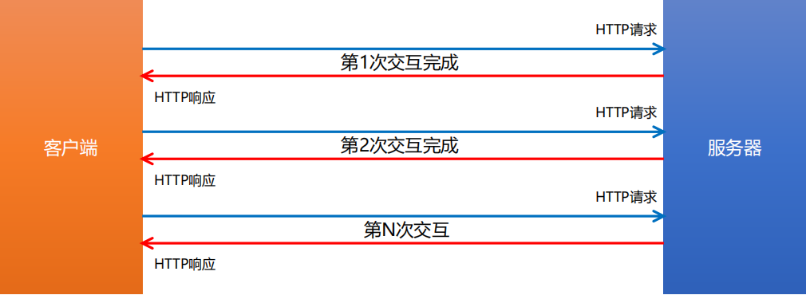

# HTTP请求消息

## 什么是HTTP请求消息

由于 `HTTP` 协议属于客户端浏览器和服务器之间的通信协议。因此，客户端发起的请求叫做 **HTTP 请求**，客户

端发送到服务器的消息，叫做 **HTTP 请求消息**。

**注意：**`HTTP` 请求消息又叫做 `HTTP` 请求报文

## HTTP请求消息的组成部分(⭐⭐⭐)

`HTTP` 请求消息由请求行（`request line`）、请求头部（ `header` ） 、空行 和 请求体 4 个部分组成。

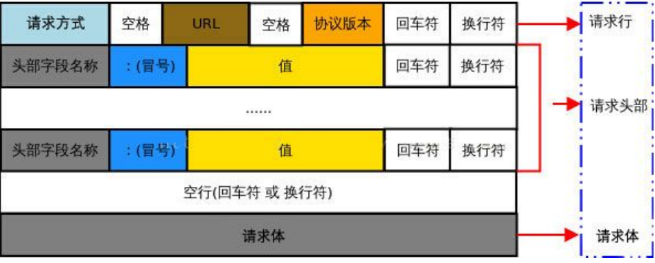

### 请求行

**请求行**由**请求方式**、**URL** 和 **HTTP 协议版本** 3 个部分组成，他们之间使用空格隔开。

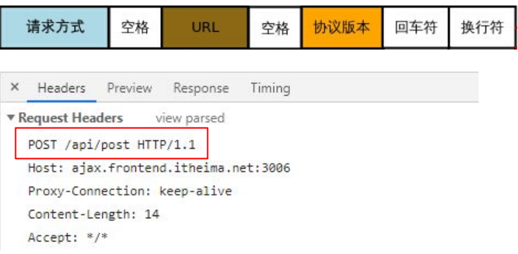

#### 请求头部

**请求头部**用来描述客户端的基本信息，从而把客户端相关的信息告知服务器。比如：User-Agent 用来说明当前是什么类型的浏览器；

`Content-Type` 用来描述发送到服务器的数据格式；Accept 用来描述客户端能够接收什么类型的返回内容；`Accept-Language` 用来描述客户端期望接收哪种人类语言的文本内容。

请求头部由多行 **键/值对** 组成，每行的键和值之间用英文的冒号分隔

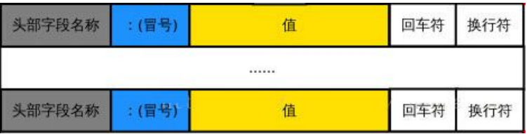

####  请求头部 – 常见的请求头字段

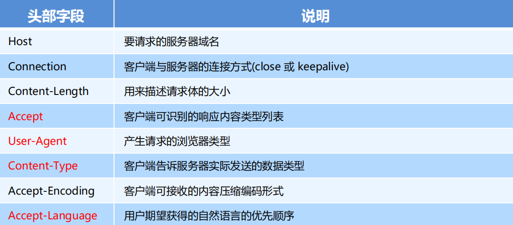

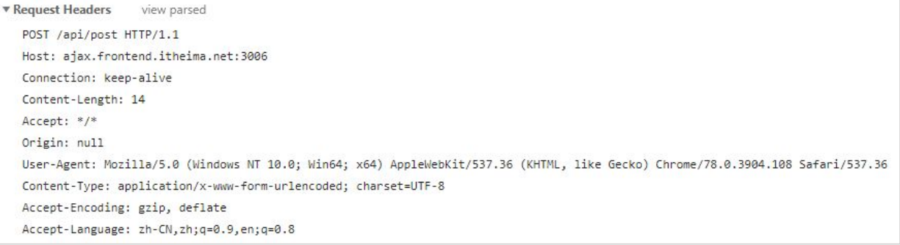

关于更多请求头字段的描述，可以查看 `MDN` 官方文档：https://developer.mozilla.org/zh-CN/docs/Web/HTTP/Headers

#### 空行

最后一个请求头字段的后面是一个**空行**，通知服务器**请求头部至此结束**。

请求消息中的**空行**，用来分隔请求头部与请求体

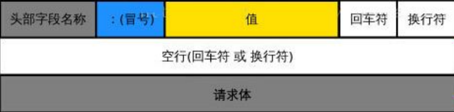

#### 请求体

请求体中存放的，是要通过 `POST` 方式提交到服务器的数据。

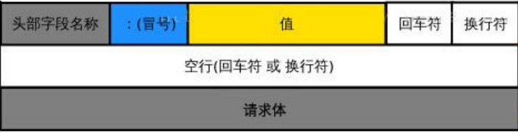

**注意**：只有 `POST` 请求才**有请求体**，`GET` 请求**没有请求体**！

# HTTP响应消息

## 什么是HTTP响应消息

**响应消息**就是服务器响应给客户端的消息内容，也叫作**响应报文**。

## HTTP响应消息的组成部分(⭐⭐⭐)

HTTP响应消息由**状态行**、**响应头部**、**空行** 和 **响应体** 4 个部分组成，如下图所示：

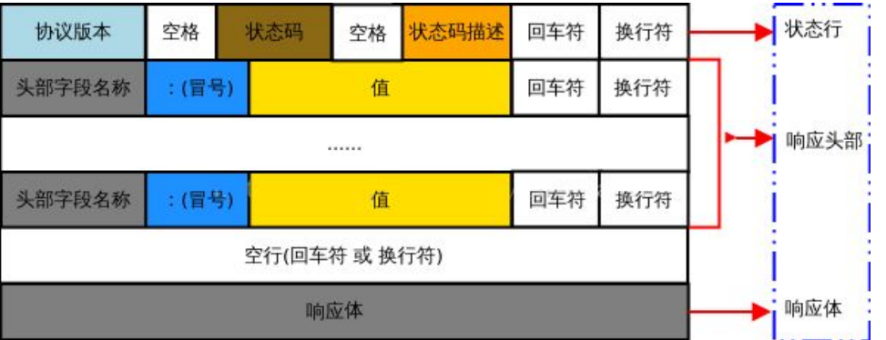

### 状态行

**状态行**由 **HTTP 协议版本**、**状态码**和**状态码的描述文本** 3 个部分组成，他们之间使用空格隔开

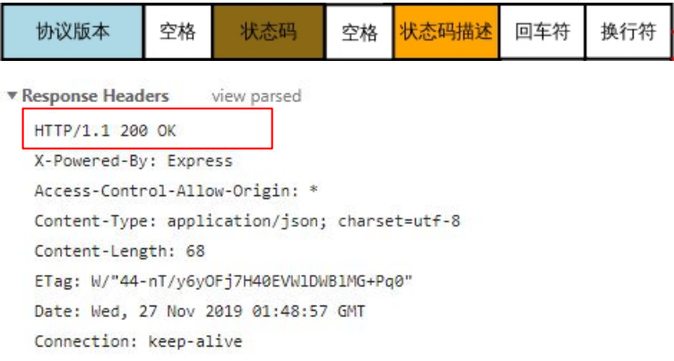

### 响应头部

**响应头部**用来描述**服务器的基本信息**。响应头部由多行 **键/值对** 组成，每行的键和值之间用英文的冒号分隔。

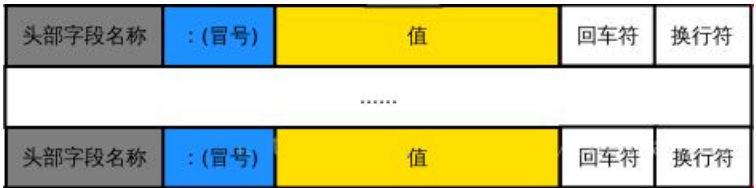

### 响应头部 – 常见的响应头字段

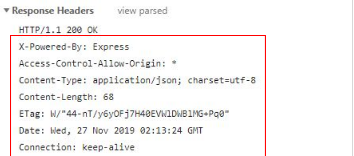

关于更多响应头字段的描述，可以查看 `MDN` 官方文档：https://developer.mozilla.org/zh-CN/docs/Web/HTTP/Headers

### 空行

在最后一个响应头部字段结束之后，会紧跟一个**空行**，用来通知客户端**响应头部至此结束**。

响应消息中的空行，用来分隔**响应头部**与**响应体**。

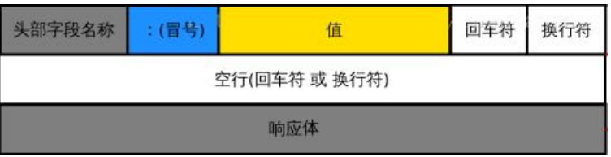

### 响应体

响应体中存放的，是服务器响应给客户端的资源内容。

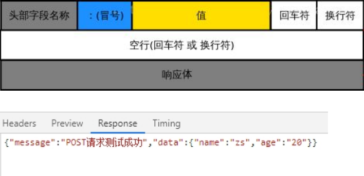

# HTTP请求方法

## 什么是HTTP请求方法

HTTP 请求方法，属于 HTTP 协议中的一部分，请求方法的作用是：用来表明**要对服务器上的资源执行的操作**。最常用的请求方法是 `GET` 和 `POST`。

## HTTP的请求方法(⭐⭐⭐)

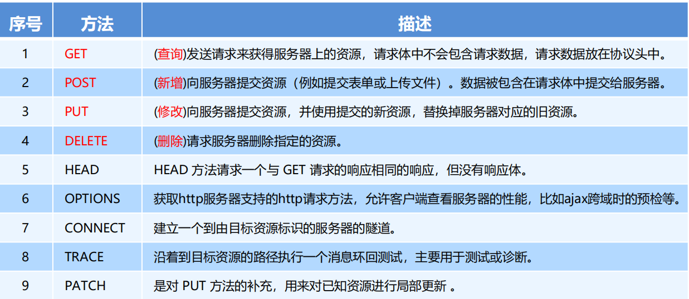

# HTTP响应状态码

## 什么是HTTP响应状态码

**HTTP 响应状态码**（`HTTP Status Code`），也属于 `HTTP` 协议的一部分，用来标识响应的状态。

响应状态码会随着响应消息一起被发送至客户端浏览器，浏览器根据服务器返回的响应状态码，就能知道这次

`HTTP` 请求的结果是成功还是失败了。

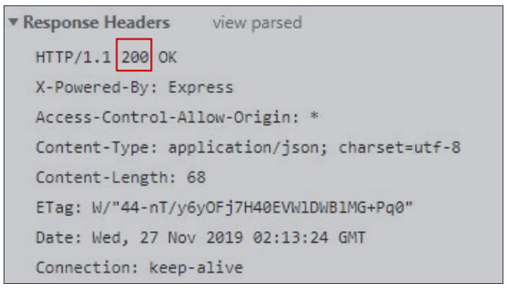

## HTTP响应状态码的组成及分类

HTTP 状态码由**三个十进制数字组成**，**第一个十进制数字定义了状态码的类型**，后两个数字**用来对状态码进行细分**。

HTTP 状态码共分为 5 种类型：

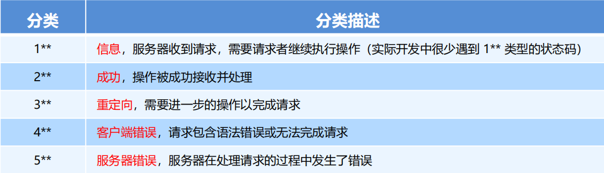

完整的 HTTP 响应状态码，可以参考 `MDN` 官方文档 https://developer.mozilla.org/zh-CN/docs/Web/HTTP/Status

## 常见的HTTP响应状态码(⭐⭐⭐)

###  2** 成功相关的响应状态码

2** 范围的状态码，表示服务器已成功接收到请求并进行处理。常见的 2** 类型的状态码如下：

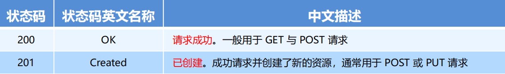

### 3** 重定向相关的响应状态码

3** 范围的状态码，表示表示服务器要求客户端重定向，需要客户端进一步的操作以完成资源的请求。常见的 3** 类型的状态码如下：

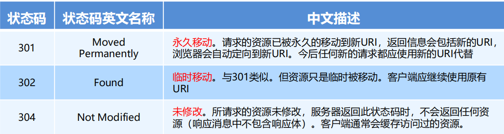

### 4\** 客户端错误相关的响应状态码

4** 范围的状态码，表示客户端的请求有非法内容，从而导致这次请求失败。常见的 4** 类型的状态码如下：

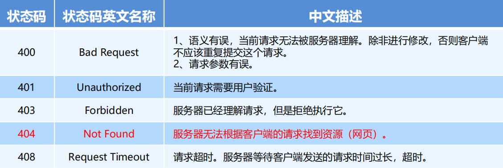

### 5\** 服务端错误相关的响应状态码

5** 范围的状态码，表示服务器未能正常处理客户端的请求而出现意外错误。常见的 5** 类型的状态码如下

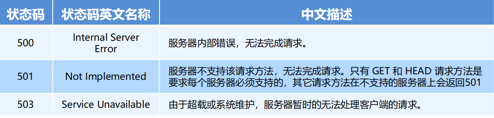