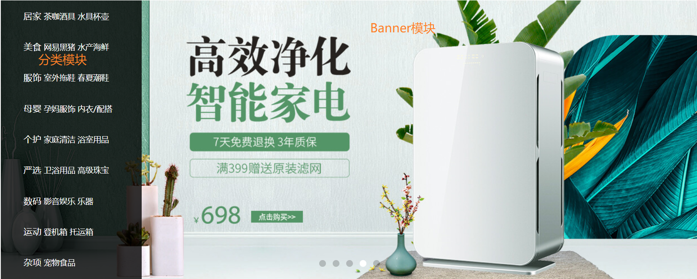
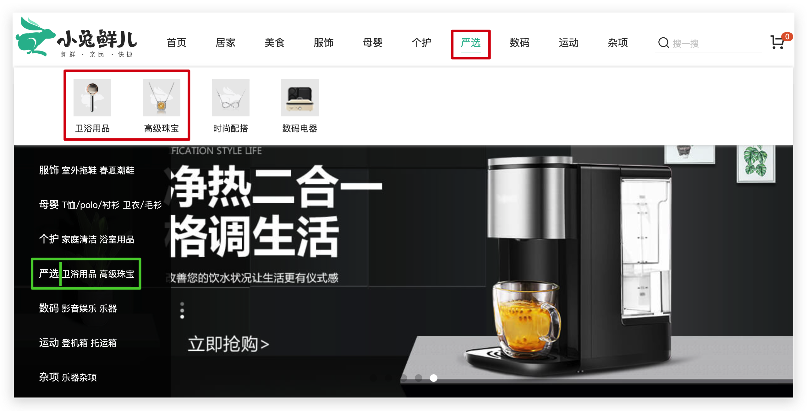
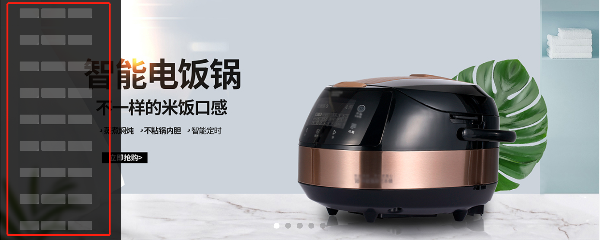
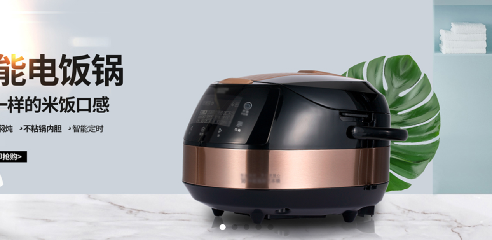
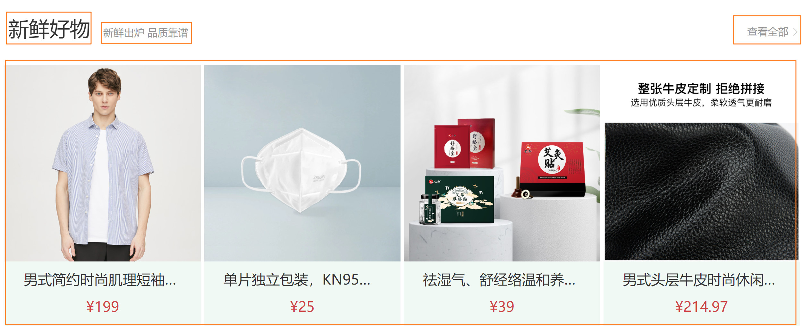
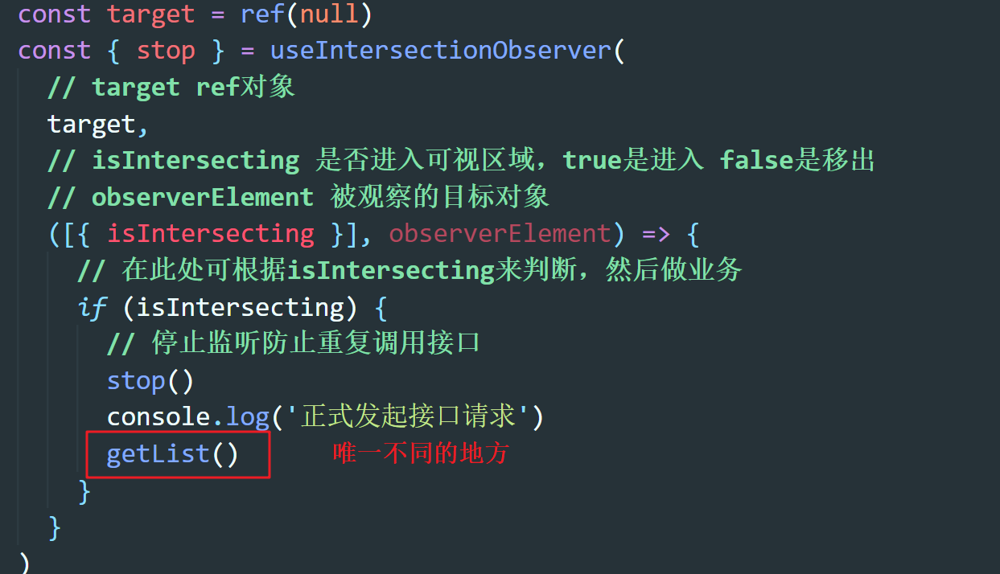

## 分类和轮播图



### 左侧分类

1）拆分左侧分类组件

`Home/components/home-category.vue`

```html
<template>
  <div class="home-category">
    <ul class="menu">
      <!-- 一级 -->
      <li v-for="item in 9" :key="item">
        <RouterLink to="/">{{ item }}</RouterLink>
        <!-- 二级 -->
        <template v-if="item.children">
          <RouterLink v-for="sub in item.children" :key="sub.id" to="/">
            {{ sub.name }}
          </RouterLink>
        </template>
      </li>
    </ul>
  </div>
</template>

<script>
export default {
  name: 'HomeCategory'
}
</script>

<style scoped lang='less'>
.home-category {
  width: 250px;
  height: 500px;
  background: rgba(0, 0, 0, 0.8);
  position: relative;
  z-index: 99;
  // 左侧菜单
  .menu {
    > li {
      padding-left: 40px;
      height: 55px;
      line-height: 55px;
      a {
        margin-right: 4px;
        color: #fff;
        &:first-child {
          font-size: 16px;
        }
      }

      // 弹层默认不显示
      .layer {
        width: 990px;
        height: 500px;
        background: rgba(255, 255, 255, 0.8);
        position: absolute;
        left: 250px;
        top: 0;
        display: none;
        padding: 0 15px;
        h4 {
          font-size: 20px;
          font-weight: normal;
          line-height: 80px;
          small {
            font-size: 16px;
            color: #666;
          }
        }
        ul {
          display: flex;
          flex-wrap: wrap;
          li {
            width: 310px;
            height: 120px;
            margin-right: 15px;
            margin-bottom: 15px;
            border: 1px solid #eee;
            border-radius: 4px;
            background: #fff;
            &:nth-child(3n) {
              margin-right: 0;
            }
            a {
              display: flex;
              width: 100%;
              height: 100%;
              align-items: center;
              padding: 10px;
              &:hover {
                background: #e3f9f4;
              }
              img {
                width: 95px;
                height: 95px;
              }
              .info {
                padding-left: 10px;
                line-height: 24px;
                overflow: hidden;
                .name {
                  font-size: 16px;
                  color: #666;
                }
                .desc {
                  color: #999;
                }
                .price {
                  font-size: 22px;
                  color: @priceColor;
                  i {
                    font-size: 16px;
                  }
                }
              }
            }
          }
        }
      }
      // 显示弹层
      &:hover {
        background: @xtxColor;
        .layer {
          display: block;
        }
      }
      // end
    }
  }
}
</style>

```

### 右侧轮播

2）拆分banner组件

`Home/components/home-banner.vue`

```html
<template>
  <div class="home-banner">
    banner
  </div>
</template>

<script>
export default {
  name: 'HomeBanner'
}
</script>

<style scoped lang='less'>
.home-banner {
  width: 1240px;
  height: 500px;
  position: absolute;
  left: 0;
  top: 0;
  z-index: 98;
}
</style>
```

3）home组件中引入使用

`Home/index.vue`

```diff
<template>
  <div class="page-home">
    <div class="home-entry">
+      <div class="container">
        <!-- 左侧分类 -->
+        <HomeCategory />
        <!-- banner轮播图 -->
+        <HomeBanner/>
+      </div>
    </div>
  </div>
</template>
<script>
+import HomeCategory from './components/home-category'
+import HomeBanner from './components/home-banner'
export default {
  name: 'PageHome',
+  components: { HomeCategory, HomeBanner }
}
</script>
```

注意：通过`.container`控制居中

## 左侧分类交互


### 渲染分类数据

> 渲染左侧菜单数据（一级和二级前两个）



`src/views/Home/components/home-category.vue`

说明❓：

1. 使用之前layout下header-nav组件获取过的分类导航数据
2. 只拿一级和一级下二级的前两个数据渲染左侧分类

```html
<template>
  <div class="home-category">
    <ul class="menu">
      <li v-for="item in list" :key="item.id">
        <RouterLink to="/">{{item.name}}</RouterLink>
        <!--
          在vue3里面
          template 只有俩种情况使用
           1. 根据某个状态渲染多个模板的，当做空标签使用  v-if v-else
           2. 插槽的场景    <tempalte #default></template>  <tempalte #footer></template>
         -->
        <template v-if="item.children.length > 0">
          <RouterLink v-for="i in item.children" :key="i.id" to="/">{{i.name}}</RouterLink>
        </template>
      </li>
    </ul>
   <!-- 弹层layer位置 -->
  </div>
</template>

<script>
// 数据：使用的vuex category中的数据 只不过需要把chilren中的前俩项数据筛选出来
// 基于某些现有的响应式数据经过一定的计算得到新的数据 -> 计算属性
import { computed } from 'vue'
import { useStore } from 'vuex'
export default {
  name: 'HomeCategory',
  setup () {
    const store = useStore()
    const list = computed(() => {
      // 基于vuex中的数据  截取children中的前俩项
      // 基于一个数组 针对于数据的每一项都做处理 然后返回一个全新的数组 map
      return store.state.category.list.map((item) => {
        return {
          id: item.id,
          name: item.name,
          children: item.children.slice(0, 2)
        }
      })
    })
    return {
      list
    }
  }
}
</script>
```

### 激活展示分类下商品

**实现步骤**

- 布局交互
  - layer弹层，默认隐藏
  - Li标签hover状态的时候layer弹层展示出来
- 数据渲染 - 鼠标移入显示当前对应分类的商品推荐
  - 完成模板渲染

**代码落地**

1）准备布局

注意：弹层结构放到和`ul.menu>li`下

```html
<!-- 弹层 -->
<div class="layer">
  <h4>分类推荐 <small>根据您的购买或浏览记录推荐</small></h4>
  <ul>
    <li v-for="i in 9" :key="i">
      <RouterLink to="/">
        
        <div class="info">
          <p class="name ellipsis-2">【定金购】严选零食大礼包（12件）</p>
          <p class="desc ellipsis">超值组合装，满足馋嘴欲</p>
          <p class="price"><i>¥</i>100.00</p>
        </div>
      </RouterLink>
    </li>
  </ul>
</div>
```

2）使用vuex中的分类数据进行渲染

```diff
    const list = computed(() => {
      // 基于vuex中的数据  截取children中的前俩项
      // 基于一个数组 针对于数据的每一项都做处理 然后返回一个全新的数组 map
      return store.state.category.list.map((item) => {
        return {
          id: item.id,
          name: item.name,
+          goods: item.goods,
          children: item.children.slice(0, 2)
        }
      })
    })
```

使用计算属性渲染模板

```html
 <!-- 弹层 -->
    <div class="layer">
      <h4>分类推荐 <small>根据您的购买或浏览记录推荐</small></h4>
      <ul>
        <li v-for="i in item.goods" :key="i.id">
          <RouterLink to="/">
            
            <div class="info">
              <p class="name ellipsis-2">{{ i.name }}</p>
              <p class="desc ellipsis">{{ i.desc }}</p>
              <p class="price"><i>¥</i>{{ i.price }}</p>
            </div>
          </RouterLink>
        </li>
      </ul>
    </div>
```

## 骨架组件

### 骨架组件封装

> 为了更好的用户体验，我们经常在数据还没正式返回之前，使用类似于占位符的UI来告知用户这里即将出现数据，以减少用户的等待焦虑感 

`本节目标:`  实现一个可定制可复用的骨架占位组件



**实现思路**

1. 搭建基础静态结构
2. 把容许用户自定义传入的属性定义为props
3. 测试组件是否按照传入的props进行展示

**代码落地**

1）定义基础骨架组件结构

`components/Skeleton/index.vue`

```html
<template>
  <div
    class="xtx-skeleton shan"
    :style="{ width: '60px', height: '30px' }"
  >
    <!-- 1 盒子-->
    <div class="block" :style="{ backgroundColor: '#efefef'}"></div>
    <!-- 2 闪效果 xtx-skeleton 伪元素 --->
  </div>
</template>
<script>
export default {
  name: 'XtxSkeleton'
}
</script>
<style scoped lang="less">
.xtx-skeleton {
  display: inline-block;
  position: relative;
  overflow: hidden;
  vertical-align: middle;
  .block {
    width: 100%;
    height: 100%;
    border-radius: 2px;
  }
}
.shan {
  &::after {
    content: "";
    position: absolute;
    animation: shan 1.5s ease 0s infinite;
    top: 0;
    width: 50%;
    height: 100%;
    background: linear-gradient(
      to left,
      rgba(255, 255, 255, 0) 0,
      rgba(255, 255, 255, 0.3) 50%,
      rgba(255, 255, 255, 0) 100%
    );
    transform: skewX(-45deg);
  }
}
@keyframes shan {
  0% {
    left: -100%;
  }
  100% {
    left: 120%;
  }
}
</style>
```

2）props设计

> 我们把骨架的宽度（width）、高度（height）、背景色（backgroundColor）定义为props，由用户自定义传入定制效果

```diff
<template>
  <div
    class="xtx-skeleton shan"
+    :style="{ width: width + 'px', height: height + 'px' }"
  >
    <!-- 1 盒子-->
+    <div class="block" :style="{ backgroundColor: bg }"></div>
    <!-- 2 闪效果 xtx-skeleton 伪元素 --->
  </div>
</template>
<script>
export default {
  name: 'XtxSkeleton',
  // 容许定制的参数包括: 背景/宽度/高度
+  props: {
+    bg: {
      type: String,
      default: '#efefef'
    },
+    width: {
      type: String,
      default: '100'
    },
+    height: {
      type: String,
      default: '100'
    }
+  }
}
</script>
```

3）测试组件props

`playground/index.vue`

```html
<!-- 骨架组件测试 -->
<XtxSkeleton width="100" height="30" bg="blue"/>
```


### 骨架组件业务使用

`任务目标:`  在分类模块中使用我们定义好的骨架组件增强用户体验

**实现思路**

1. 把测试完毕的骨架屏组件定义成全局组件
2. 在业务组件中根据数据是否返回渲染不同的模板（有数据渲染正常模板，没有数据渲染骨架屏）

**前置知识** 

1. 全局组件和局部组件

2. vue3.x如何定义插件和使用插件

   [vue3.x插件说明](https://v3.cn.vuejs.org/guide/plugins.html#%E7%BC%96%E5%86%99%E6%8F%92%E4%BB%B6)

**代码落地**

1）以插件的形式注册为全局可用

`src/components/index.js`

```js
import Skeleton from './Skeleton'

export default {
  install (app) {
    app.component(Skeleton.name, Skeleton)
  }
}
```

2）注册插件

`main.js`

```js
import componentPlugin from '@/components'
createApp(App).use(store).use(router).use(componentPlugin).mount('#app')
```

3）业务组件使用

```html
<template>
  <div class="home-category">
    <!-- 正式数据渲染 -->
    <template v-if="list.length > 0">
      <ul class="menu">
        <li
          v-for="item in list"
          :key="item.id"
          @mouseenter="mouseenter(item.id)"
        >
          <RouterLink to="/">{{ item.name }}</RouterLink>
          <!--
          在vue3里面
          template 只有俩种情况使用
           1. 根据某个状态渲染多个模板的  v-if v-else
           2. 插槽的场景    <tempalte #default></template>  <tempalte #footer></template>
         -->
          <template v-if="item.children.length > 0">
            <RouterLink v-for="i in item.children" :key="i.id" to="/">{{
              i.name
            }}</RouterLink>
          </template>
          <!-- 弹层layer位置 -->
          <div class="layer">
            <h4>分类推荐 <small>根据您的购买或浏览记录推荐</small></h4>
            <ul>
              <li v-for="i in item.goods" :key="i.id">
                <RouterLink to="/">
                  
                  <div class="info">
                    <p class="name ellipsis-2">
                      {{ i.name }}
                    </p>
                    <p class="desc ellipsis">{{ i.desc }}</p>
                    <p class="price"><i>¥</i>{{ i.price }}</p>
                  </div>
                </RouterLink>
              </li>
            </ul>
          </div>
        </li>
      </ul>
    </template>
    <!-- 骨架屏占位 -->
    <template v-else>
      <ul class="menu">
        <li v-for="i in 9" :key="i">
          <XtxSkeleton
            :width="40"
            :height="20"
            style="margin-right: 5px"
            bg="rgba(255,255,255,0.2)"
          />
          <XtxSkeleton
            :width="50"
            :height="20"
            bg="rgba(255,255,255,0.2)"
            style="margin-right: 5px"
          />
          <XtxSkeleton :width="50" :height="20" bg="rgba(255,255,255,0.2)" />
        </li>
      </ul>
    </template>
  </div>
</template>
```

## 集成轮播图

> 我们接下来实现右侧banner的部分，这个部分主要是一个轮播图的展示，使用封装好组件集成



### 轮播图组件使用

#### 1. 导入组件和全局注册

`任务目标:` 注册轮播图组件

> 说明：多张轮播图片通过绝对定位放到同一个位置，先统一把透明度设置为0，统一不显示，如果某一项符合要求就加上类名fade，透明度会转成1，即会显示

1）`02-其它资源/components/Slider`集成组件到项目`components/Slider/index.vue`

2） 全局注册组件

```diff
import XtxSkeleton from './Skeleton'
+ import XtxSlider from './Slider'
export default {
  install (app) {
    // 注册全局组件
    app.component(XtxSkeleton.name, XtxSkeleton)
+    app.component(XtxSlider.name, XtxSlider)
  }
}
```

####  2. 轮播图业务使用

`任务目标:`  在实际banner模块中使用我们封装好的轮播图组件

> 轮播图的所有功能我们都单独的实现完毕并进行了功能测试，现在我们可以在业务里使用我们的轮播图了

1）封装获取banner数据接口函数

`src/api/home.js`

```js
/**
 * @description: 获取banner图
 * @param {*}
 * @return {*}
 */
export const findBanner = () => {
  return request('home/banner', 'get')
}
```

2）业务组件使用

`views/Home/components/home-banner.vue`

```html
<template>
  <div class="home-banner">
    <XtxSlider :sliders="bannerList"/>
  </div>
</template>

<script>
import { findBanner } from '@/api/home'
import { onMounted, ref } from 'vue'
export default {
  name: 'HomeBanner',
  setup () {
    const bannerList = ref([])
    async function loadBannerList () {
      // 参数修改
      // ajax
      const res = await findBanner()
      bannerList.value = res.result
    }
    onMounted(() => {
      // 调用函数
      loadBannerList()
    })
    return {
      bannerList
    }
  }
}
</script>

<style scoped lang='less'>
.home-banner {
  width: 1240px;
  height: 500px;
  position: absolute;
  left: 0;
  top: 0;
  z-index: 98;
}
</style>
```


## 第三天重点总结


## 商品面板组件

> 新鲜好物、人气推荐俩个模块的布局结构上非常类似，我们可以抽离出一个通用的面板组件来进行复用

`任务目标:`  封装实现一个通用的面板组件



**思路分析**

1. 图中标出的四个部分都是可能会发生变化的，需要我们定义为可配置
2. 主标题和副标题由于是纯文本，我们定义成props即可
3. 右侧内容和主体内容由于可能会传入较为复杂的自定义模板，我们定义成slot利用插槽渲染

**代码落地**

1）组件编写

`Home/components/home-panel.vue`

```html
<template>
  <div class="home-panel">
    <div class="container">
      <div class="head">
        <h3>
          {{ title }}<small>{{ subTitle }}</small>
        </h3>
        <!-- 右侧内容区域 -->
        <slot name="right" />
      </div>
      <!-- 主体内容区域 -->
      <slot />
    </div>
  </div>
</template>

<script>
export default {
  name: 'HomePanel',
  props: {
    // 主标题
    title: {
      type: String,
      default: ''
    },
    // 副标题
    subTitle: {
      type: String,
      default: ''
    }
  }
}
</script>

<style scoped lang='less'>
.home-panel {
  background-color: #fff;
  .head {
    padding: 40px 0;
    display: flex;
    align-items: flex-end;
    h3 {
      flex: 1;
      font-size: 32px;
      font-weight: normal;
      margin-left: 6px;
      height: 35px;
      line-height: 35px;
      small {
        font-size: 16px;
        color: #999;
        margin-left: 20px;
      }
    }
  }
}
</style>
```

2）组件测试

`views/playground/index.vue`

```html
<template>
  <!-- 面板组件测试 -->
  <home-panel title="人气推荐" sub-title="人气爆款 不容错过">
    <template #right>
      <span>查看更多</span>
    </template>
    <template>
       <div>我是主体内容</div>
    </template>
  </home-panel>
</template>

<script>
import HomePanel from '@/views/Home/components/home-panel'
export default {
  components: {
    HomePanel
  }
}
</script>
```

## 新鲜好物业务实现

`任务目标:`  使用封装好的面板组件实现新鲜好物数据渲染显示


1）封装接口

`api/home.js`

```js
/**
 * @description: 获取新鲜好物
 * @param {*}
 * @return {*}
 */
export const findNew = () => {
  return request('home/new', 'get')
}
```

2）使用面板组件渲染

* 新建home-new组件

说明⚠：需要注册使用`More`组件

`Home/components/home-new.vue`

```html
<template>
  <HomePanel title="新鲜好物" sub-title="新鲜出炉 品质靠谱">
    <template #right>
      <xtx-more></xtx-more>
    </template>
    <template #default>
      <ul ref="pannel" class="goods-list">
        <li v-for="item in list" :key="item.id">
          <RouterLink to="/">
            
            <p class="name">{{ item.name }}</p>
            <p class="price">&yen;{{ item.price }}</p>
          </RouterLink>
        </li>
      </ul>
    </template>
  </HomePanel>
</template>

<script>
import HomePanel from './home-panel'
import { findNew } from '@/api/home'
import { ref } from 'vue'
export default {
  components: {
    HomePanel
  },
  setup () {
    // 1.定义响应式数据
    const list = ref([])

    return {
      list
    }
  }
}
</script>

<style scoped lang='less'>
.goods-list {
  display: flex;
  justify-content: space-between;
  height: 406px;
  li {
    width: 306px;
    height: 406px;
    background: #f0f9f4;
    // 激活效果
    transition: all 0.5s;
    &:hover {
      transform: translate3d(0, -6px, 0);
      box-shadow: 0 6px 8px rgba(0, 0, 0, 0.2);
    }
    // end
    img {
      width: 306px;
      height: 306px;
    }
    p {
      font-size: 22px;
      padding-top: 12px;
      text-align: center;
      text-overflow: ellipsis;
      overflow: hidden;
      white-space: nowrap;
    }
    .price {
      color: @priceColor;
    }
  }
}
</style>
```


3）home组件首页使用

```diff
<template>
  <div class="page-home">
    <div class="home-entry">
      <div class="container">
        <!-- 左侧分类 -->
        <HomeCategory />
        <!-- banner轮播图 -->
        <HomeBanner/>
        <!-- 新鲜好物 -->
+        <HomeNew/>
      </div>
    </div>
  </div>
</template>
<script>
import HomeCategory from './components/home-categroy'
import HomeBanner from './components/home-banner'
// 新鲜好物
+ import HomeNew from './components/home-new'
export default {
  name: 'PageHome',
  components: { HomeCategory, HomeBanner,
+  HomeNew }
}
</script>
```


## 人气推荐业务实现

`任务目标:`  使用封装好的面板组件实现人气推荐数据渲染显示


1）封装接口

`api/home.js`

```js
/**
 * @description: 获取人气推荐
 * @param {*}
 * @return {*}
 */
export const findHot = () => {
  return request('home/hot', 'get')
}
```

2）使用面板组件渲染

`Home/components/home-hot.vue`

```html
<template>
  <HomePanel title="人气推荐" sub-title="人气爆款 不容错过">
    <ul class="goods-list">
      <li v-for="item in goods" :key="item.id">
        <RouterLink to="/">
          
          <p class="name">{{item.title}}</p>
          <p class="desc">{{item.alt}}</p>
        </RouterLink>
      </li>
    </ul>
    <template #right>
      <xtx-more></xtx-more>
    </template>
  </HomePanel>
</template>

<script>
import HomePanel from './home-panel'
import { findHot } from '@/api/home'
export default {
  name: 'HomeHot',
  components: { HomePanel },
  data () {
    return {
      goods: []
    }
  },
  async created () {
    const data = await findHot()
    this.goods = data.result
  }
}
</script>

<style scoped lang='less'>
.goods-list {
  display: flex;
  justify-content: space-between;
  height: 426px;
  li {
    width: 306px;
    height: 406px;
    img {
      width: 306px;
      height: 306px;
    }
    p {
      font-size: 22px;
      padding-top: 12px;
      text-align: center;
    }
    .desc {
      color: #999;
      font-size: 18px;
    }
  }
}
</style>
```

3）home组件首页使用

```diff
<template>
  <div class="page-home">
    <div class="home-entry">
      <div class="container">
        <!-- 左侧分类 -->
        <HomeCategory />
        <!-- banner轮播图 -->
        <HomeBanner/>
        <!-- 新鲜好物 -->
        <HomeNew/>
        <!-- 人气推荐 -->
+        <HomeHot/>
      </div>
    </div>
  </div>
</template>
<script>
import HomeCategory from './components/home-categroy'
import HomeBanner from './components/home-banner'
import HomeNew from './components/home-new'
+ import HomeHot from './components/home-hot'
export default {
  name: 'PageHome',
  components: { HomeCategory, HomeBanner, HomeNew,
+  HomeHot }
}
</script>
```

## 组件数据懒加载

### 理解组件数据懒加载

`任务目标:`  从实际角度理解组件数据懒加载指的是什么

**思考俩个问题**

1. 我们一般的数据请求在哪里发起？
2. 生命周期钩子函数的特点是什么？

> 我们现在每个组件中发起ajax请求一般都是在created钩子函数或者mounted钩子函数中发起的，生命周期有一个特点：**跟着组件的初始化过程走自动执行，开发者无法控制**，所以我们现在首页中的人气推荐/新鲜好物等模块中的请求一旦组件渲染ajax请求就会发起，而电商类的首页页面一般会很长，有的模块组件甚至都不会出现在视口中，这样无脑的加载数据，显然是不合理的存在浪费，为了解决这个问题，我们引入了组件数组懒加载

**结论（何为组件数据懒加载？）**

只有组件正式进入到视口中时，才把组件内部的ajax请求发起，否则不请求数据

**优点**

1. 提高页面渲染性能
2. 减轻了服务器的压力

### 如何判断组件进入视口

`任务目标:`  了解如何通过技术手段得知组件进入了视口

**技术方案：**

我们可以使用 `@vueuse/core` 中的 `useIntersectionObserver` 来实现监听组件进入可视区域行为，需要配合vue3.0的组合API的方式才能实现

https://vueuse.org/core/useIntersectionObserver/

先分析下这个`useIntersectionObserver` 函数：

```js
const { stop } = useIntersectionObserver(
  target,
  ([{ isIntersecting }], observerElement) => {
    targetIsVisible.value = isIntersecting
  }
)
/*
  1.stop 一个可执行的函数用来停止监听行为
  2.target 一个由ref api调用之后形成的RefImpl对象 也可以是一个dom对象
  3.isIntersecting 一个类型为布尔值的数据 当被监听元素进入视口区域时为true,离开视口区域时为false
  特别注意: 对于目标target是否进入视口区域的监听会一直进行不会只监听一次
*/
```

我们以`人气推荐模块`为例演示一下这个函数的使用方式

1）通过ref属性获得组件实例

```html
<template>
  <HomePanel ref="hotRef" title="人气推荐" sub-title="人气爆款 不容错过">
    ...
  </HomePanel>
</template>

<script>
export default {
  name: 'HomeHot',
  components: { HomePanel },
  setup () {
    // 1.定义要监听的目标dom容器
    const hotRef = ref(null)
    onMounted(() => {
      console.log(hotRef)
    })
    // 2.return出去
    return {
      hotRef
    }
  }
}
</script>
```

2）使用`useIntersectionObserver`监听函数

```js
export default {
  name: 'HomeHot',
  components: { HomePanel },
  setup () {
    const hotRef = ref(null)
    useIntersectionObserver(
      // target 是观察的目标dom容器，必须是dom容器，而且是vue3.0方式绑定的dom对象
      hotRef,
      // isIntersecting 是否进入可视区域，true是进入 false是移出
      // observerElement 被观察的dom
      ([{ isIntersecting }], observerElement) => {
        // 在此处可根据isIntersecting来判断，然后做业务
        console.log(isIntersecting)
      }
    )
    return {
      hotRef
    }
  }
}
```

3）测试效果

打开浏览器，人气推荐模块还未进入到视口，打印值为false，然后我们滑动页面，当`人气模块`组件进入视口中时，再次发生打印，此时为true，到此我们就可以判断组件进入和移除视口了

**特别注意⚠️：**每次被监听的dom进入移出视口时都会触发一次，而不是只触发一次

### 具体业务实现

`任务目标:`  利用我们捋清楚的发送请求的位置实现业务数据拉取完成实际业务功能

**实现步骤**

1. 把先前在onMouted钩子里发送的ajax请求在`isIntersecting` 为true时触发
2. 一旦触发一次之后停止监听，**防止接口重复调用**

**代码落地**

```jsx
<HomePanel ref="target" title="人气推荐" sub-title="人气爆款 不容错过"></HomePanel>

export default {
  name: 'HomeHot',
  components: { HomePanel },
  setup () {
    const list = ref([])
    async function getList () {
      const res = await findHot()
      list.value = res.result
    }
    const target = ref(null)
    const { stop } = useIntersectionObserver(
      // target 是观察的目标dom容器，必须是dom容器，而且是vue3.0方式绑定的dom对象
      target,
      // isIntersecting 是否进入可视区域，true是进入 false是移出
      // observerElement 被观察的dom
      ([{ isIntersecting }], observerElement) => {
        // 在此处可根据isIntersecting来判断，然后做业务
        if (isIntersecting) {
          // 停止监听防止重复调用接口
          stop()
          console.log('正式发起接口请求')
          getList()
        }
      }
    )
    return {
      target,
      goodsRef
    }
}
```

### 组件数据懒加载逻辑复用

`本节目标:`  抽离组件数据懒加载可复用的逻辑

#### 现存问题

> 首页中，很多地方都应该使用组件数据懒加载这个功能，不管是哪个模块使用，下面代码都会重复书写，事实上，唯一可能会随着业务使用发生变化的是getList函数也就是ajax接口的调用，其余的部分我们进行重复使用，抽离为可复用逻辑




#### 抽离通用逻辑

1）抽离逻辑

`src/hooks/index.js`

```js
// 封装监听目标元素进入视口的通用逻辑
import { useIntersectionObserver } from '@vueuse/core'
import { ref } from 'vue'
export function useObserver (apiFn) {
  // 监听的目标对象
  const target = ref(null)
  // stop 是一个可执行的方法 调用就会停止监听
  // 不管元素进入还是离开视口区域都不会再执行回调函数
  // 注意：不会只监听一次  只有进入视口或者离开视口回调函数都会执行
  const { stop } = useIntersectionObserver(
    // 监听目标元素
    target,
    ([{ isIntersecting }], observerElement) => {
      // isIntersecting 布尔值 代表当前监听的元素是否进入视口区域
      console.log(isIntersecting)
      // ...判断  一旦为true 就发送ajax
      if (isIntersecting) {
        // 关闭监控是否进入视口
        stop()
        // 发起网络请求
        apiFn()
      }
    }
  )
  return {
    target
  }
}
```

2）业务改写

```html
<script>
import HomePanel from './home-panel'
import { findHot } from '@/api/home'
import { ref } from 'vue'
import { useObserver } from '@/compositions'
export default {
  name: 'HomeHot',
  components: { HomePanel },
  setup () {
    const list = ref([])
    async function getList () {
      const res = await findHot()
      list.value = res.data.result
    }
    const { target } = useObserver(getList)
    return {
      list,
      target
    }
  }
}
</script>
```

## 商品楼层区块（作业）

`任务目标:`  实现商品楼层区域的结构布局和数据渲染


**实现步骤**

1. 准备一个商品盒子组件 `home-goods` 展示单个商品
2. 定义产品楼层区块组件 `home-product` 使用`home-pannel`和 `home-goods` 完成基础布局
3. 在首页中使用 `home-product` 组件
4. 定义API函数，获取数据，进行渲染
5. 处理板块需要进入可视区才能加载数据问题

**代码落地**

### 创建组件

1）新建单个商品组件

`src/views/Home/components/home-goods.vue`

```vue
<template>
  <div class="goods-item">
    <RouterLink to="/" class="image">
      
    </RouterLink>
    <p class="name ellipsis-2">美威 智利原味三文鱼排 240g/袋 4片装</p>
    <p class="desc">海鲜年货</p>
    <p class="price">&yen;108.00</p>
    <div class="extra">
      <RouterLink to="/">
        <span>找相似</span>
        <span>发现现多宝贝 &gt;</span>
      </RouterLink>
    </div>
  </div>
</template>

<script>
export default {
  name: 'HomeGoods'
}
</script>

<style scoped lang='less'>
.goods-item {
  width: 240px;
  height: 300px;
  padding: 10px 30px;
  position: relative;
  overflow: hidden;
  border: 1px solid transparent;
  transition: all .5s;
  .image {
    display: block;
    width: 160px;
    height: 160px;
    margin: 0 auto;
    img {
      width: 100%;
      height: 100%;
    }
  }
  p {
    margin-top: 6px;
    font-size: 16px;
    &.name {
      height: 44px;
    }
    &.desc {
      color: #666;
      height: 22px;
       overflow: hidden;
      text-overflow: ellipsis;
      white-space: nowrap;
    }
    &.price {
      margin-top: 10px;
      font-size: 20px;
      color: @priceColor;
    }
  }
  .extra {
    position: absolute;
    left: 0;
    bottom: 0;
    height: 86px;
    width: 100%;
    background: @xtxColor;
    text-align: center;
    transform: translate3d(0,100%,0);
    transition: all .5s;
    span {
      display: block;
      color: #fff;
      width: 120px;
      margin: 0 auto;
      line-height: 30px;
      &:first-child {
        font-size: 18px;
        border-bottom:1px solid #fff;
        line-height: 40px;
        margin-top: 5px;
      }
    }
  }
  &:hover {
    border-color: @xtxColor;
    .extra {
      transform: none;
    }
  }
}
</style>
```

2）新建产品区块组件

`src/views/Home/components/home-product.vue`

```vue
<template>
  <div class="home-product">
    <!-- 面板组件 -->
    <HomePanel title="生鲜" v-for="i in 4" :key="i">
      <template #right>
        <div class="sub">
          <RouterLink to="/">海鲜</RouterLink>
          <RouterLink to="/">水果</RouterLink>
          <RouterLink to="/">蔬菜</RouterLink>
          <RouterLink to="/">水产</RouterLink>
          <RouterLink to="/">禽肉</RouterLink>
        </div>
        <XtxMore />
      </template>
      <div class="box">
        <RouterLink class="cover" to="/">
          
          <strong class="label">
            <span>生鲜馆</span>
            <span>全场3件7折</span>
          </strong>
        </RouterLink>
        <ul class="goods-list">
          <li v-for="i in 8" :key="i">
            <!-- 商品组件 -->
            <HomeGoods />
          </li>
        </ul>
      </div>
    </HomePanel>
  </div>
</template>

<script>
import HomePanel from './home-panel'
import HomeGoods from './home-goods'
export default {
  name: 'HomeProduct',
  components: { HomePanel, HomeGoods }
}
</script>

<style scoped lang='less'>
.home-product {
  background: #fff;
  height: 2900px;
  .sub {
    margin-bottom: 2px;
    a {
      padding: 2px 12px;
      font-size: 16px;
      border-radius: 4px;
      &:hover {
        background: @xtxColor;
        color: #fff;
      }
      &:last-child {
        margin-right: 80px;
      }
    }
  }
  .box {
    display: flex;
    .cover {
      width: 240px;
      height: 610px;
      margin-right: 10px;
      position: relative;
      img {
        width: 100%;
        height: 100%;
        object-fit: cover;
      }
      .label {
        width: 188px;
        height: 66px;
        display: flex;
        font-size: 18px;
        color: #fff;
        line-height: 66px;
        font-weight: normal;
        position: absolute;
        left: 0;
        top: 50%;
        transform: translate3d(0,-50%,0);
        span {
          text-align: center;
          &:first-child {
            width: 76px;
            background: rgba(0,0,0,.9);
          }
          &:last-child {
            flex: 1;
            background: rgba(0,0,0,.7);
          }
        }
      }
    }
    .goods-list {
      width: 990px;
      display: flex;
      flex-wrap: wrap;
      li {
        width: 240px;
        height: 300px;
        margin-right: 10px;
        margin-bottom: 10px;
        &:nth-last-child(-n+4) {
          margin-bottom: 0;
        }
        &:nth-child(4n) {
          margin-right: 0;
        }
      }
    }
  }
}
</style>
```

3）home组件中使用

`src/views/home/index.vue`

```diff
<template>
  <div class="page-home">
    <div class="home-entry">
      <div class="container">
        <!-- 左侧分类 -->
        <HomeCategory />
        <!-- banner轮播图 -->
        <HomeBanner/>
        <!-- 新鲜好物 -->
        <HomeNew/>
        <!-- 人气推荐 -->
        <HomeHot/>
        <!-- 商品模块 -->
+       <HomeProduct/>
      </div>
    </div>
  </div>
</template>
<script>
import HomeCategory from './components/home-categroy'
import HomeBanner from './components/home-banner'
import HomeNew from './components/home-new'
import HomeHot from './components/home-hot'
// 引入
+ import HomeProduct from './components/home-product'
export default {
  name: 'PageHome',
  components: { HomeCategory, HomeBanner, HomeNew, HomeHot,
+  HomeProduct }
}
</script>
```

### 数据渲染

4）获取数据渲染

- 定义API   `src/api/home.js`

```js
/**
 * @description: 获取所有商品模块
 * @param {*}
 * @return {*}
 */
export const findGoods = () => {
  return request('home/goods', 'get')
}
```

- 进行渲染

`home/components/home-product.vue`

```html
<template>
  <div class="home-product">
    <HomePanel :title="cate.name" v-for="cate in goodsProduct" :key="cate.id">
      <template v-slot:right>
        <div class="sub">
          <RouterLink v-for="sub in cate.children" :key="sub.id" to="/">{{
            sub.name
          }}</RouterLink>
        </div>
        <XtxMore />
      </template>
      <div class="box">
        <RouterLink class="cover" to="/">
          
          <strong class="label">
            <span>{{ cate.name }}馆</span>
            <span>{{ cate.saleInfo }}</span>
          </strong>
        </RouterLink>
        <ul class="goods-list">
          <!-- 把数据通过props传入HomeGoods组件 -->
          <li v-for="item in cate.goods" :key="item.id">
            <HomeGoods :goods="item" />
          </li>
        </ul>
      </div>
    </HomePanel>
  </div>
</template>

<script>
import HomePanel from './home-panel'
import HomeGoods from './home-goods'
import { findGoods } from '@/api/home'
import { onMounted, ref } from 'vue'
export default {
  name: 'HomeProduct',
  components: { HomePanel, HomeGoods },
  setup () {
    // 定义ref数据
    const goodsProduct = ref([])
    // 定义获取数据函数
    async function getGoods () {
      const { result } = await findGoods()
      goodsProduct.value = result
    }
    // mounted钩子函数中调用
    onMounted(() => {
      getGoods()
    })
    // return出去供模板使用
    return { goodsProduct }
  }
}
</script>
```

`home/components/home-goods.vue`

```html
<template>
  <div class="goods-item">
    <RouterLink to="/" class="image">
      
    </RouterLink>
    <p class="name ellipsis-2">{{ goods.name }}</p>
    <p class="desc">{{ goods.tag }}</p>
    <p class="price">&yen;{{ goods.price }}</p>
    <div class="extra">
      <RouterLink to="/">
        <span>找相似</span>
        <span>发现现多宝贝 &gt;</span>
      </RouterLink>
    </div>
  </div>
</template>

<script>
export default {
  name: 'HomeGoods',
  props: {
    goods: {
      type: Object,
      default: () => { }
    }
  }
}
</script>
```

### 数据懒加载和优化

5）组件数据懒加载

```diff
<template>
  <!-- 创建绑定 -->
  <div class="home-product"
+ ref="target">
    ...
  </div>
</template>

<script>
import HomePanel from './home-panel'
import HomeGoods from './home-goods'
import { findGoods } from '@/api/home'
import { ref } from 'vue'
+ import { useObserver } from '@/compositions'
export default {
  name: 'HomeProduct',
  components: { HomePanel, HomeGoods },
  setup () {
    // 任务: 把这里变成组件懒加载形式
    const goodsList = ref([])
    async function getGoodsList () {
      const res = await findGoods()
      goodsList.value = res.data.result
    }
+    const { target } = useObserver(getGoodsList)
    return {
      goodsList,
+      target
    }
  }
}
</script>

```

6）加载时机优化

> 存在问题：产品区域需要滚动比较多才能去加载数据，**出现拖动断层空白**
>
> 解决方案：加一个`threshold`参数即可

```diff
// 封装监听目标元素进入视口的通用逻辑
import { useIntersectionObserver } from '@vueuse/core'
import { ref } from 'vue'
export function useObserver (apiFn) {
  // 监听的目标对象
  const target = ref(null)
  // stop 是一个可执行的方法 调用就会停止监听
  // 不管元素进入还是离开视口区域都不会再执行回调函数
  // 注意：不会只监听一次  只有进入视口或者离开视口回调函数都会执行
  const { stop } = useIntersectionObserver(
    // 监听目标元素
    target,
    ([{ isIntersecting }], observerElement) => {
      // isIntersecting 布尔值 代表当前监听的元素是否进入视口区域
      console.log(isIntersecting)
      // ...判断  一旦为true 就发送ajax
      if (isIntersecting) {
        stop()
        // 发起网络请求
        apiFn()
      }
    },
+    // 进入当前元素可视区域的比例是多少才执行回调 0-1 值越大 代表需要进入的面积越大
+    { threshold: 0 }
  )
  return {
    target
  }
}
```

说明：threshold 容器和可视区交叉的占比（进入的面积/容器完整面积） 取值为0-1 之间，默认比0大，所以需要滚动较多才能触发进入可视区域事件

## 图片懒加载 

> 商品区块虽然我们已经做了组件数据懒加载，但是由于它内部的图片非常多，如果一个组件内图片非常多的时候，我们依旧有必要做一下图片懒加载，把性能优化做到极致

`任务目标:`  使用插件的注册方式实现图片懒加载指令

### 了解vue3中指令写法

前置知识：[vue3中的全局指令定义](https://v3.cn.vuejs.org/api/application-api.html#directive) 

**实现步骤**

1. 熟悉vue3全局指令的定义方式
2. 以插件的形式注册全局指令
3. 编写懒加载指令的具体逻辑

**代码落地**

### 定义全局指令插件

1）定义懒加载全局指令插件

`scr/directives/index.js`

```js
export default {
  install (app) {
    // 定义全局指令
  }
}
```

2）main.js中注册插件

```js
import defineDirective from '@/directives'
createApp(App).use(store).use(router).use(componentPlugin).use(directivePlugin).mount('#app')
```

### 图片懒加载指令实现

3）编写指令逻辑

> 核心思路：监听图片是否进入到视口，正式进入视口之后将图片url数据交给img标签的src属性

```js
import defaltImg from '@/assets/images/200.png'
// 引入监听是否进入视口
import { useIntersectionObserver } from '@vueuse/core'
export default {
  // 需要拿到main.js中由createApp方法产出的app实例对象
  install (app) {
    // app实例身上有我们想要的全局注册指令方法  调用即可
    app.directive('imgLazy', {
      mounted (el, binding) {
        // el:img dom对象
        // binding.value  图片url地址
        // 使用vueuse/core提供的监听api 对图片dom进行监听 正式进入视口才加载
        // img.src = url
        console.log(el, binding)
        const { stop } = useIntersectionObserver(
          // 监听目标元素
          el,
          ([{ isIntersecting }], observerElement) => {
            if (isIntersecting) {
              // 当图片url无效加载失败的时候使用默认图片替代
              el.onerror = function () {
                el.src = defaltImg
              }
              el.src = binding.value
              stop()
            }
          },
          // 刚进入视口区域就立刻执行回调 0 - 1 
          { threshold: 0 }
        )
      }
    })
  }
}
```

4）测试使用

`home-product.vue`

```html

```

`home-goods.vue`

```html

```

> 打开chrome调试面板，network下的img请求，有没有随着滚动行为的发生图片的请求逐渐变多了起来

## 第四天重点总结


